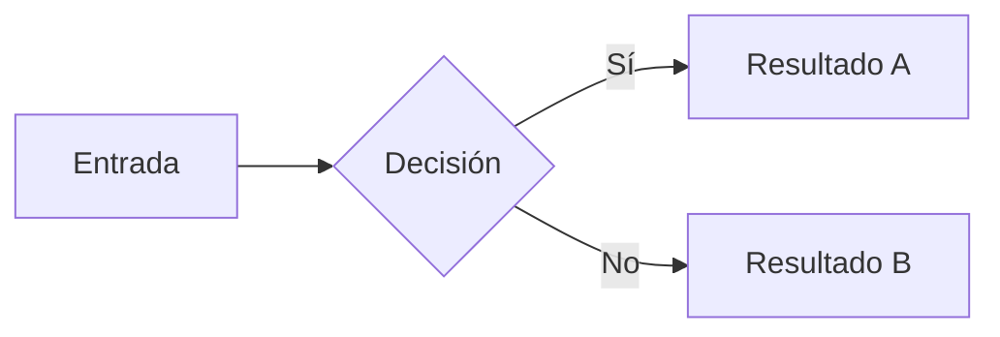
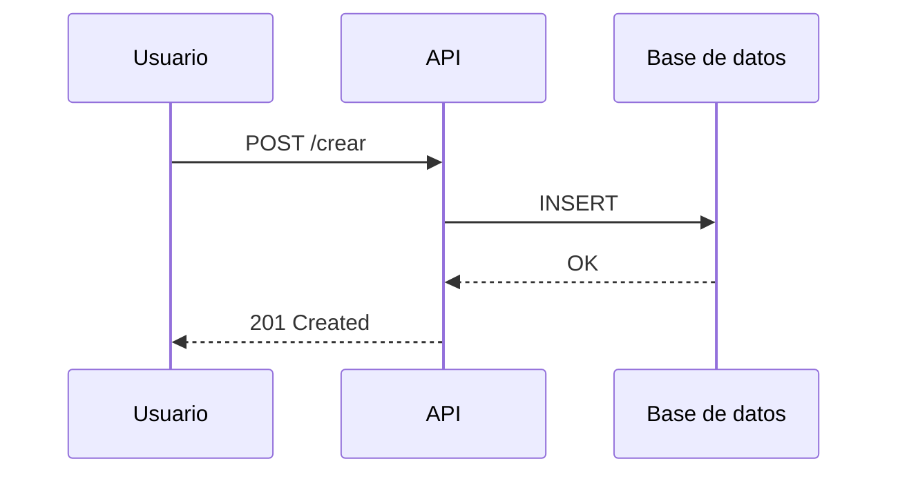

# Guía Slidev: Crear una presentación

Slidev es un framework web para crear presentaciones técnicas interactivas con Vue, animaciones, demos en vivo y presenter mode integrado.

## Cuándo usar Slidev

✅ **Usa Slidev si necesitas:**
- Presenter mode con notas privadas y timer
- Demos en vivo (código ejecutable, componentes Vue)
- Animaciones y transiciones avanzadas
- Diagramas Mermaid interactivos
- Presentación web moderna y responsive

❌ **No uses Slidev para:**
- Solo PDF y ODP (usa Marp)
- Presentaciones muy simples
- Si necesitas máxima portabilidad offline

## Crear tu primera presentación Slidev

### Paso 1: Generar la estructura

```bash
./scripts/new-presentacion.sh --engine slidev
```

O si el script aún no soporta `--engine`:

Crea manualmente la estructura:

```bash
mkdir -p presentaciones/mi-presentacion/slidev/public
mkdir -p presentaciones/mi-presentacion/assets/images
```

Luego copia los archivos de configuración desde el piloto en `presentaciones/red-soberana-de-ia/slidev/`.

### Paso 2: Configurar Slidev

Crea los siguientes archivos en `presentaciones/mi-presentacion/slidev/`:

**`slides.md`** — Tu presentación (ver sintaxis más abajo)

**`package.json`:**
```json
{
  "name": "mi-presentacion-slidev",
  "version": "1.0.0",
  "private": true,
  "scripts": {
    "dev": "slidev",
    "build": "slidev build",
    "export": "slidev export"
  },
  "dependencies": {
    "@slidev/cli": "latest",
    "@slidev/theme-default": "latest",
    "vue": "^3.3.0"
  }
}
```

**`vite.config.ts`:**
```typescript
import { defineConfig } from 'vite'
import vue from '@vitejs/plugin-vue'

export default defineConfig({
  plugins: [vue()],
  resolve: {
    alias: {
      '@': new URL('./src', import.meta.url).pathname,
    },
  },
})
```

**`slidev.config.ts`:**
```typescript
import { defineConfig } from '@slidev/cli'

export default defineConfig({
  // Configuración de Slidev
  highlighter: 'shiki',
  download: false,
})
```

**Enlazar assets:**
```bash
cd presentaciones/mi-presentacion/slidev
ln -s ../assets public
```

### Paso 3: Instalar dependencias

```bash
npm install --prefix presentaciones
```

### Paso 4: Editar la presentación

Abre `presentaciones/mi-presentacion/slidev/slides.md` y escribe tu presentación.

**Estructura básica:**

```markdown
---
theme: default
title: Mi presentación increíble
layout: cover
---

# Mi presentación increíble

Una presentación técnica con Slidev

---

# Contenido

- Punto 1
- Punto 2
- Punto 3

---

## Código

```python
def hola():
    print("Hola mundo")
```

---

layout: two-cols

# Izquierda

Contenido aquí

::right::

# Derecha

Contenido aquí

---

# Fin
```

### Paso 5: Modo desarrollo

```bash
just slidev-dev presentaciones/mi-presentacion/slidev/slides.md
```

O directamente:
```bash
cd presentaciones/mi-presentacion/slidev
npm run dev
```

Abre <http://localhost:3030>. Presiona `?` para ver controles (presenter mode, notas, etc.).

## Sintaxis Slidev: Diapositivas

### Estructura básica

```markdown
---
# Frontmatter YAML (configuración de la slide)
layout: cover
title: Slide 1
---

# Contenido de la diapositiva

Markdown normal aquí

---

# Siguiente slide

Automáticamente separada por `---`
```

### Layouts predefinidos

Slidev incluye layouts para diferentes tipos de slides:

```markdown
---
layout: cover
---
# Slide de portada

---

layout: intro
---
# Slide de introducción

---

layout: statement
---
# Statement (cita o frase destacada)

---

layout: two-cols
---

# Izquierda

Contenido aquí

::right::

# Derecha

Contenido aquí

---

layout: image-left
image: ./public/imagen.png
---

# Contenido con imagen a la izquierda

---

layout: image-right
image: ./public/imagen.png
---

# Contenido con imagen a la derecha

---

layout: image
image: ./public/full-background.png
---

# Slide con fondo de imagen

---

layout: center
class: text-center
---

# Contenido centrado
```

### Animaciones y transiciones

```markdown
---
transition: slide-left
---

# Transición de entrada: slide desde la izquierda

---

transition: fade
---

# Transición: fade

---

# Animaciones v-click

- Punto 1 (visible desde el inicio)
- Punto 2 <-- Click aquí para revelar
- Punto 3 <-- Click de nuevo

Con v-clicks:

<v-click>
- Aparece con click 1
</v-click>

<v-click>
- Aparece con click 2
</v-click>

<v-click>
- Aparece con click 3
</v-click>
```

### Notas del presentador

```markdown
# Mi presentación

Contenido visible para la audiencia

<!--
Las notas van en comentarios HTML.
Solo visibles en presenter mode (Ctrl+P).

- Recordar mencionar X
- Pausar aquí para preguntas
- Demo en vivo del código
-->

---

# Otra slide

Visible para todos

<!--
Presentador: No olvides el ejemplo interactivo
-->
```

Presiona `Ctrl+P` durante la presentación para ver notas.

### Código con highlight

```markdown
## Código básico

```python
def fibonacci(n):
    if n <= 1:
        return n
    return fibonacci(n-1) + fibonacci(n-2)
```

---

## Highlight de líneas

```javascript {2,4-6}
function greet() {
  console.log("Hola");    // <-- Highlight
  
  for (let i = 0; i < 3; i++) {  // <-- Highlight (rango)
    console.log(i);               // <-- Highlight
  }                               // <-- Highlight
}
```

---

## Evolución del código (click por click)

```python {all|1|2-4|5}
# Línea 1: solo esta
# Líneas 2-4: ahora estas
# Línea 5: finalmente esta
# Presiona → para ver la evolución
```
```

### Mermaid interactivo

```markdown
## Diagrama interactivo



---

## Flowchart más complejo


```

### Imágenes y figuras

```markdown
## Imagen simple


---

## Imagen responsive


---

## Imagen con caption

<div class="text-center">
  
  <p class="text-sm">Diagrama de arquitectura</p>
</div>
```

### Componentes Vue personalizados

```markdown
## Usando un componente Vue

<MyCustomComponent />

---

## Componente con props

<Counter :start="10" />
```

Crea componentes en `presentaciones/mi-presentacion/slidev/components/`:

**`Counter.vue`:**
```vue
<template>
  <div class="text-center">
    <p class="text-2xl font-bold">{{ count }}</p>
    <button @click="count++" class="px-4 py-2 bg-blue-500 text-white">
      Incrementar
    </button>
  </div>
</template>

<script setup>
import { ref } from 'vue'

const props = defineProps({
  start: {
    type: Number,
    default: 0,
  },
})

const count = ref(props.start)
</script>
```

### Tabla

```markdown
## Tabla en Slidev

| Encabezado 1 | Encabezado 2 |
|---|---|
| Celda A1 | Celda B1 |
| Celda A2 | Celda B2 |
```

## Generar salida

### PDF

```bash
just slidev-export presentaciones/mi-presentacion/slidev/slides.md pdf
```

Genera: `presentaciones/mi-presentacion/slidev/dist/slides.pdf`

### PPTX

```bash
just slidev-export presentaciones/mi-presentacion/slidev/slides.md pptx
```

⚠️ **Nota:** El PPTX contiene una imagen por diapositiva; no es editable como en Slidev.

### PNG (una imagen por slide)

```bash
just slidev-export presentaciones/mi-presentacion/slidev/slides.md png
```

### HTML estática

```bash
cd presentaciones/mi-presentacion/slidev
npm run build
```

Genera: `dist/index.html` listo para servir.

## Exportar para InsightBloom

Cuando tu presentación esté lista:

```bash
just zip mi-presentacion --engine slidev
```

Genera: `mi-presentacion-slidev.zip` con estructura:

```
mi-presentacion-slidev.zip
├── README.md
├── slidev.project.json           # Marca como proyecto Slidev
├── source/
│   ├── slides.md
│   ├── package.json
│   ├── slidev.config.ts
│   ├── vite.config.ts
│   ├── components/
│   └── public/                   # Assets compartidos
└── dist/
    ├── index.html                # Ejecutable directamente
    └── assets/
```

InsightBloom puede:
1. Servir `dist/index.html` directamente
2. O reconstruir con `npm install && npm run build` en `source/`

## Frontmatter completo

```markdown
---
# Tema
theme: default

# Título y metadatos
title: Mi presentación
description: Descripción de la presentación
author: Tu nombre

# Layout
layout: cover

# Transición para esta slide
transition: slide-left

# Clase CSS global
class: text-center

# Desabilitar paginación para esta slide
paginate: false

# Click interactivo
clicks: 3

# Nota del presentador
note: |
  Recordar mencionar X
  Pausar para preguntas
---
```

## Personalizar tema

Crea `presentaciones/mi-presentacion/slidev/theme.css`:

```css
:root {
  --slidev-color-primary: #0066cc;
  --slidev-color-secondary: #00d4ff;
  --slidev-font-family: 'Inter', sans-serif;
}

.slidev-layout {
  background: #ffffff;
  color: #1a1a1a;
}

h1, h2, h3 {
  color: var(--slidev-color-primary);
}

code {
  background: #f0f0f0;
  padding: 2px 6px;
  border-radius: 3px;
}
```

## Talleres con Marp y Slidev

Un taller puede conservar su fuente Marp y agregar una versión Slidev paralela.
El contenido práctico sigue viviendo en `ejercicios/`; Slidev sólo agrega otro
engine para presentar o publicar el material.

```bash
just new-taller mi-taller "Mi taller" "python" "vscode" --engine slidev
just generate mi-taller -t taller                 # Marp: PDF/ODP
just slidev-dev talleres/mi-taller/slidev/slides.md
just slidev-insightbloom-zip mi-taller -t taller # ZIP MVP
```

La estructura resultante es:

```text
talleres/mi-taller/
├── mi-taller.md       # fuente Marp, permanece vigente
├── assets/
├── ejercicios/
└── slidev/
    ├── slides.md
    ├── package.json
    ├── slidev.config.ts
    ├── vite.config.ts
    └── public -> ../assets
```

El ZIP MVP materializa el enlace `public` y conserva sólo `slides.md` y los
assets permitidos; no sube ejercicios, dependencias ni configuraciones de
build.

## Ejemplos en el repositorio

Mira el piloto de Slidev como referencia:

- [Red soberana de IA - Slidev](../presentaciones/red-soberana-de-ia/slidev/slides.md)
- [Configuración Vite](../presentaciones/red-soberana-de-ia/slidev/vite.config.ts)
- [Configuración Slidev](../presentaciones/red-soberana-de-ia/slidev/slidev.config.ts)

## Recursos

- [Documentación oficial de Slidev](https://sli.dev)
- [Temas y componentes](https://sli.dev/themes/gallery.html)
- [Integración con Vue](https://sli.dev/guide/syntax#vue)
- [Mermaid en Slidev](https://sli.dev/guide/syntax#diagrams)
