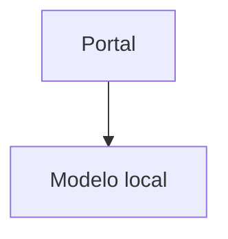

# Evaluación incremental de Slidev

## Decisión

Slidev es una buena incorporación para presentaciones técnicas nuevas o para
diapositivas que necesiten demos Vue, animaciones, Mermaid interactivo o CSS
avanzado. No conviene reemplazar Marp de una sola vez: las fuentes actuales
usan directivas Marp, el repositorio ya genera ODP y el ZIP de release depende
de esa ruta.

La estrategia recomendada es mantener dos backends durante la evaluación:

| Necesidad | Backend | Estado |
|---|---|---|
| Presentaciones existentes | Marp | Predeterminado y sin cambios |
| PDF y ODP de release | Marp | Compatible con el flujo actual |
| Prototipos técnicos | Slidev | Opt-in |
| Presentación web con presenter mode | Slidev | Opt-in |
| PPTX para compartir | Slidev | Posible, pero cada slide se exporta como imagen |
| ZIP para InsightBloom | Proyecto Slidev + build estática | Compatible mediante `just slidev-zip` |

## Qué se comprobó

El piloto `red-soberana-de-ia/slidev/slides.md` valida:

- Markdown con frontmatter Slidev y transición `slide-left`.
- Tema `seriph`, layout `two-cols` y slots `::right::`.
- Animaciones `v-clicks`.
- Diagrama Mermaid con tema claro.
- Notas del presentador en comentarios HTML.
- Assets existentes de la presentación Marp, sin modificar el deck original.
- Exportación PDF reproducible mediante el script opt-in.
- ZIP transportable con la fuente Slidev, manifiesto y `dist/index.html`.

## Límites que evitan una migración masiva

- `<!-- _class: ... -->` y `![bg ...]` son sintaxis Marp; hay que traducirlas
  manualmente a layouts, `background` y CSS de Slidev.
- La exportación oficial de Slidev cubre PDF, PNG, PPTX y Markdown; no sustituye
  la salida ODP actual.
- El PPTX de Slidev contiene imágenes por diapositiva, por lo que el texto no
  queda editable/seleccionable como en un deck nativo.
- Slidev añade una instalación Node más pesada y Playwright/Chromium para
  exportar. Es un coste del backend opt-in, no del flujo Marp existente.
- En el piloto, `slidev/public` es un enlace a `../assets`; las imágenes que
  vienen de `public/` se consumen con `:src` para que Vite no intente resolverlas
  como imports fuera del proyecto.

## Flujo recomendado

```bash
npm install --prefix presentaciones
just slidev-dev presentaciones/red-soberana-de-ia/slidev/slides.md
just slidev-export presentaciones/red-soberana-de-ia/slidev/slides.md pdf
```

El comando `just generate ...` sigue usando Marp. El comando `just zip ...`
también sigue siendo Marp y no incluye `slidev/`. Para una fuente Slidev usa
el comando específico:

```bash
just slidev-zip presentaciones/red-soberana-de-ia/slidev/slides.md
# Alternativa integrada al comando zip existente:
just zip red-soberana-de-ia --engine slidev
```

Ese comando genera `dist/red-soberana-de-ia-slidev.zip` con esta estructura:

```text
README.md
source/slides.md
source/public/...
source/vite.config.ts
source/package.json
slidev.project.json
dist/index.html
dist/assets/...
```

InsightBloom puede servir `dist/index.html` directamente o reconstruirlo con
`source/package.json` y `slidev.project.json`. Así se conserva la
interactividad de Slidev, los componentes Vue, Mermaid, CSS, layouts,
transiciones y notas. No hay una conversión intermedia a Marp.

### Contrato para InsightBloom

El backend puede detectar un ZIP Slidev buscando `slidev.project.json` en la
raíz. Si existe y `format` vale `slidev`:

1. Descomprime el ZIP en un directorio aislado.
2. Sirve `dist/` como raíz del slideshow si `dist/index.html` existe.
3. Si necesita reconstruir, ejecuta `npm install` dentro de `source/` y luego
   `npm run build`; el resultado esperado vuelve a ser `dist/index.html`.
4. Conserva `source/` como fuente descargable y `dist/` como artefacto servido.

El manifiesto actual es deliberadamente pequeño y versionado:

```json
{
  "format": "slidev",
  "formatVersion": 1,
  "entry": "slides.md",
  "sourceDir": "source",
  "staticDir": "dist",
  "packageManager": "npm",
  "buildCommand": "npm run build"
}
```

Los ZIP sin este manifiesto siguen entrando por el camino Marp existente.

Para incluirla en el ciclo `just release`, crea un `.release.yaml` junto a la
presentación:

```yaml
name: mi-charla-slidev
engine: slidev
md: slidev/slides.md
published: false
republish: false
```

`engine: marp` sigue siendo el valor predeterminado para los manifiestos
existentes.

## Crear una presentación Slidev nueva

Partiendo de la estructura del repositorio:

```bash
just new-presentacion "mi-charla" "Mi charla técnica"
mkdir -p presentaciones/mi-charla/slidev
ln -s ../assets presentaciones/mi-charla/slidev/public
cp presentaciones/red-soberana-de-ia/slidev/vite.config.ts \
   presentaciones/mi-charla/slidev/vite.config.ts
```

Crea `presentaciones/mi-charla/slidev/slides.md` con este mínimo:

````markdown
---
theme: seriph
title: Mi charla técnica
transition: slide-left
---

# Mi charla técnica

Una frase que explique el valor de la charla.

---
layout: two-cols
---

# Arquitectura

- Nodo local
- Modelo pequeño

::right::


````

Previsualiza con `just slidev-dev ...`. Exporta para revisar el resultado con
`just slidev-export ... pdf`; antes de subir a InsightBloom genera el ZIP con
`just slidev-zip ...`.

Referencias oficiales: [inicio de Slidev](https://sli.dev/guide/),
[layouts](https://sli.dev/guide/write-layout),
[componentes Vue](https://sli.dev/guide/component) y
[exportación](https://sli.dev/guide/exporting).

## Criterio para ampliar el uso

Después de una charla real, sólo promover Slidev para más decks si aporta una
mejora verificable en al menos dos de estos puntos: demo en vivo, animación,
layout técnico, presenter mode o reutilización de componentes. Marp seguirá
siendo la opción de compatibilidad cuando ODP, el ZIP actual o una fuente ya
estable sean la prioridad.
