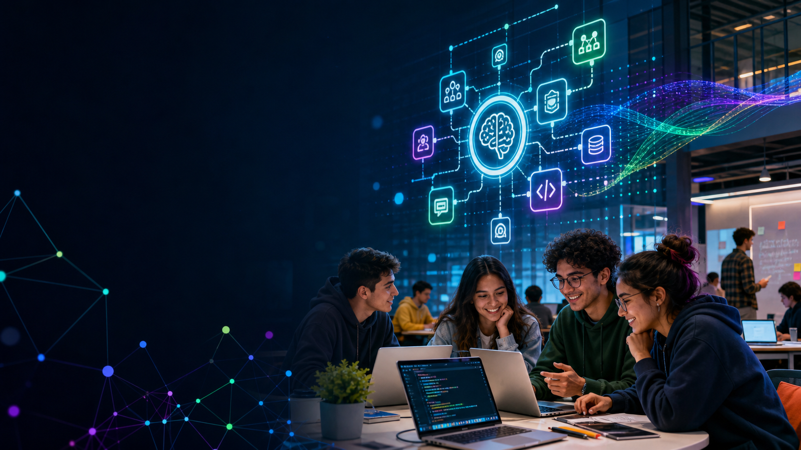
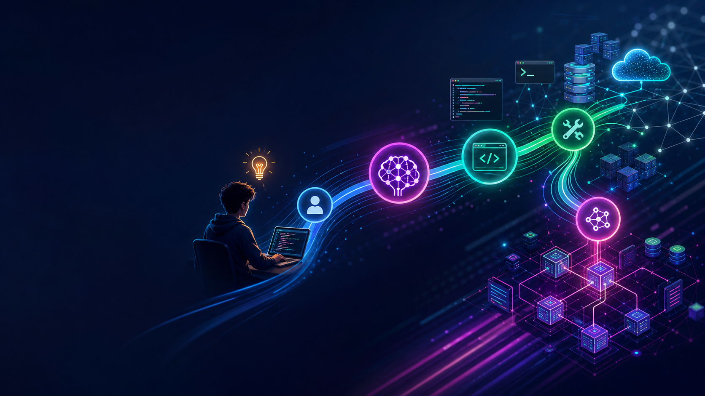
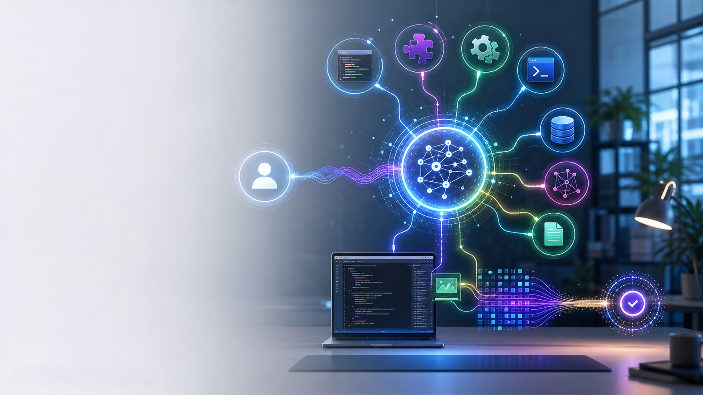
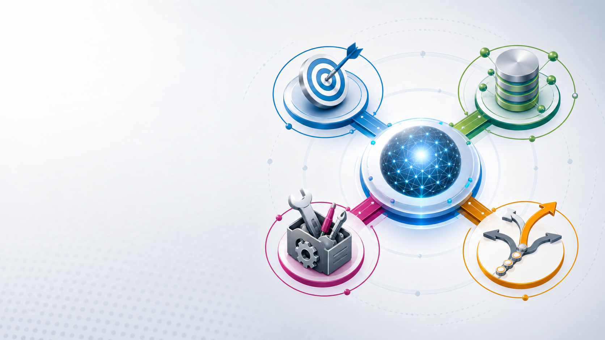
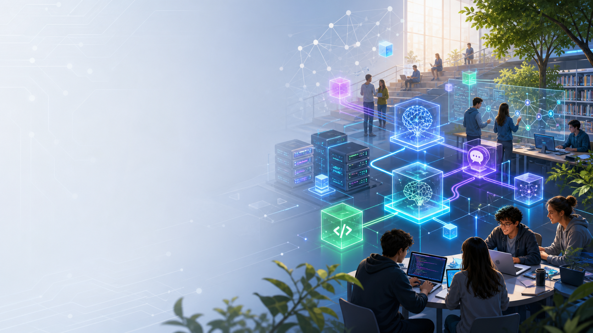
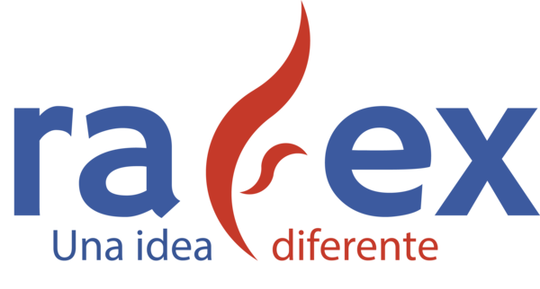

<!--
Conferencia: 13:00 - 14:00
Foro de Tecnologías de la Información y Software Libre 2026
Universidad Politécnica de Tlaxcala
Lema: Ecosistemas Digitales: Redes, Software Libre e Inteligencia Artificial impulsando la Educación en Tecnologías de la Información.
-->

<!-- _class: cover -->

# Dale un boost a tus desarrollos con IA

## usando herramientas Open Source

Raúl Eduardo González Argote

---

🤔 ¿La IA reemplazará a los desarrolladores?

<!-- notes:
Pedir que levanten la mano.
¿Cuántos creen que sí?
¿Cuántos creen que no?
Ambas respuestas son incompletas.
La pregunta correcta es otra.
-->

---

🤔 ¿Un desarrollador con IA reemplazará a uno que no la usa?

<!-- notes:
Esta es la pregunta importante.
La historia de la tecnología siempre ha sido así:
- compiladores
- frameworks
- cloud
- automatización
La IA es una nueva capa de abstracción.
-->

---

🎓 Recién egresado

Certificado por Sun Microsystems.

Convencido de que estaba listo.

<!-- notes:
Contar el contexto personal:
- Primer empleo formal de 8 horas y un poco más.
- Venía de estudiar, certificarme y creer que eso significaba estar preparado.
- Para muchos estudiantes, una certificación se siente como la meta.
-->

---

😅 Mi primer golpe de realidad

Primer empleo.

- IBM Middleware.
- IBM WebSphere Portal.
- SOAP.
- Endpoints/Web Services.

**Y yo no tenía idea de cómo conectar todo.**

<!-- notes:
Aquí hacerlo conversacional.
No hacerlo heroico: hacerlo honesto.
Tenía teoría, tenía Java, tenía certificación, pero el problema real era integrar piezas reales para que un sistema real funcionara.
-->

---

🤝 Lo que me salvó

- No fue Java.
- No fue la certificación.
- No fue un libro.

**Fue un compañero que un sábado fue a trabajar para enseñarme.**

<!-- notes:
Hacer pausa.
Dejar que la idea respire.
Ese sábado entendí la diferencia entre saber una tecnología y construir soluciones.
-->

---

# Ese día entendí algo:

El valor de un profesional no está en lo que memoriza.

Está en su capacidad para aprender.

---

# La mejor inversión de mi carrera

*no fue una certificación.*

**Fue aprender a aprender.**

---

## Mi carrera no avanzó por lo que sabía.

# **Avanzó por lo rápido que podía dejar de no saber.**

<!-- notes:
Esta es la frase que conecta con estudiantes.
No vender seguridad falsa: vender método, curiosidad y humildad técnica.
-->

---

# 2012

- Tenía una certificación.

> Pero necesitaba ayuda.

---

# 2026

- Tengo Claude.
- Tengo ChatGPT.
- Tengo Codex.
- Tengo OpenCode.

**Y sigo necesitando ayuda.**

---

# La diferencia

Ahora algunas de esas ayudas son agentes. Son boosts a mi productividad.

<!-- notes:
Aquí entra IA naturalmente.
No como magia.
No como reemplazo de compañeros.
Como una nueva forma de apoyo técnico que también hay que aprender a dirigir.
-->

---

# La tecnología cambia.

La necesidad de aprender de otros no.

---

Durante estos años sobreviví a…

* 🧱 SOAP
* 🚌 ESB
* 🧩 SOA
* 🖥️ Virtualización
* ☁️ Cloud
* ⚙️ DevOps
* 🧬 Microservicios
* 🚢 Kubernetes
* 🛠️ Platform Engineering
* 🤖 IA Generativa

<!-- notes:
La tecnología cambia.
Los principios permanecen.
-->

--- 

💡 La mejor tecnología nunca fue el objetivo

Lo que realmente importa

* 🧠 Resolver problemas
* 🏗️ Diseñar sistemas
* ⚡ Aprender rápido
* 🤝 Pedir ayuda
* 🔄 Adaptarse
* 📣 Comunicar

*Las tecnologías cambian.*
**Las habilidades permanecen.**

---

🚀 Estamos viviendo otro cambio de plataforma

<!-- _class: bg-dark -->

Antes:

Persona → IDE → Código

---

🚀 Hoy

<!-- _class: bg-dark -->

Persona → IA → IDE → Código

--- 

🚀 Mañana (esto ya nos alcanzó, es el ahora)

<!-- _class: bg-dark -->

Persona → Agente → Herramientas → Sistemas

---

🤖 ¿Qué es un agente?

No es un chatbot.

Es software que persigue un objetivo usando herramientas.

--- 

Un agente tiene

* Objetivo
* Memoria
* Herramientas
* Capacidad de decisión

---

Ahora diseñamos

* 🧭 Contexto
* 💬 Prompts
* 🛠️ Herramientas
* 🔌 MCPs
* 🔁 Workflows
* 🤖 Agentes

--- 

## Open Source cambió mi carrera

<!-- _class: bg-light -->

> Gracias al software libre aprendí

* ☕ Java
* 🧱 JBoss
* 🐧 Debian
* 🧪 Jenkins
* 🌿 Git
* 🖥️ Xen
* 📦 LXC
* 📚 Alfresco
* ✨ etc...

---

🌎 Open Source está democratizando la IA

<!-- _class: bg-light -->

* 🦙 LLama.cpp
* 🧠 Ollama
* 🪟 Open WebUI
* 🔎 DeepSeek
* 🌐 Qwen
* 🦙 Llama
* 🕸️ LangGraph
* 🧲 Qdrant
* 🔌 MCP

---

Por primera vez

<!-- _class: bg-light -->

Una universidad puede tener su propia IA.

Sin depender totalmente de

* OpenAI
* Anthropic
* Google
* Microsoft

---

# Soberanía tecnológica

<!-- _class: bg-light -->

*No significa aislarse.*

**Significa elegir.**

---

Mi stack actual

* 🧠 Claude, Codex, OpenCode
* 💬 ChatGPT
* 🕸️ LangGraph
* 🔌 MCP
* ⚡ Groq, DeepSeek, OpenRouter
* 🧩 Ether Brain

---

# La pregunta ya no es

¿Qué modelo usas?

---

# La pregunta es

**¿Qué eres capaz de construir?**

- La IA sola no resuelve problemas
- Las herramientas tampoco
- Los modelos tampoco

**La arquitectura sí**

---

Las habilidades más valiosas para 2027

* 🧩 Abstracción
* 🏗️ Diseño
* 📣 Comunicación
* 🌐 Sistemas distribuidos
* 🗃️ Datos
* 🤖 IA aplicada

---

# Lo que menos me preocupa

*Que la IA escriba código.*

---

# Lo que más me preocupa

**Que los desarrolladores dejen de pensar.**

---

🎯 Si hoy volviera a ser estudiante

Yo aprendería:

1. 🐍 Python, Java, Rust, Go, JavaScript
2. 🌿 Git
3. 🐧 Linux
4. 🔌 APIs
5. 🤖 IA
6. 🏗️ Arquitectura

---

# Tu ventaja competitiva

*No será usar IA.*

**Será entender problemas.**

---

# Porque al final…

<!-- _class: bg-dark -->

*La IA genera código.*

**Los humanos generan propósito.**

---

<!-- _class: bg-dark -->

- 🏗️ Construye.
- 🔨 Rompe.
- 📏 Mide.
- 🌎 Comparte.

---

*"La IA no elimina la ingeniería de software. La vuelve más importante."*

<!-- _class: bg-dark -->

- 🔗 [**LinkedIn**](https://www.linkedin.com/in/soft-architect-raul-gonzalez) para seguir en contacto
- ✉️ [**rafex@rafex.dev**](mailto:rafex@rafex.dev) para dudas o charlas
- 💻 [**https://github.com/rafex**](https://github.com/rafex)
- 📝 [**https://theworldofrafex.blog**](https://theworldofrafex.blog/)
