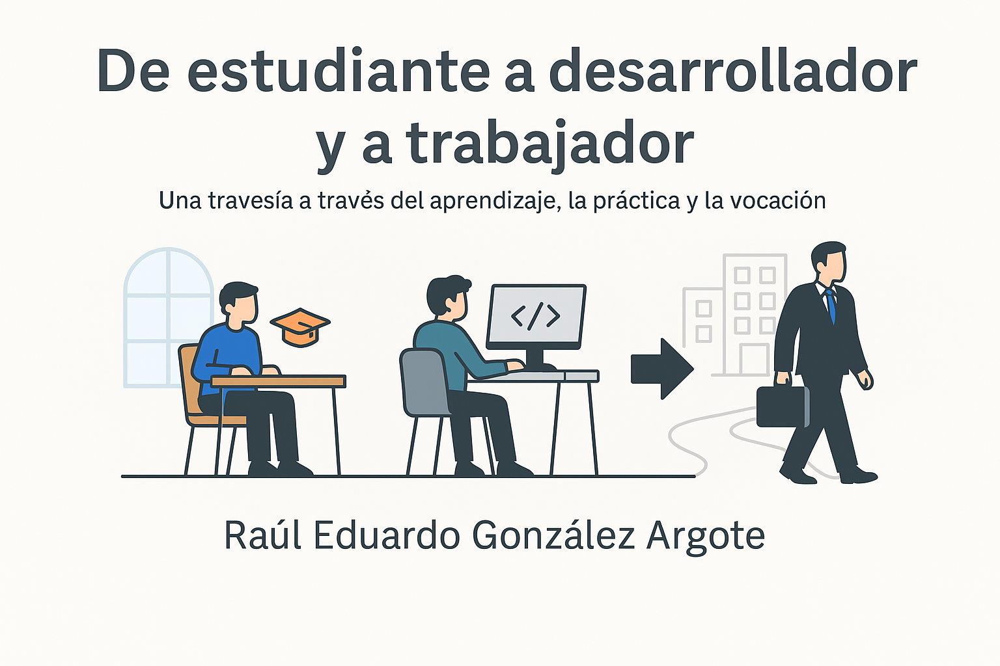
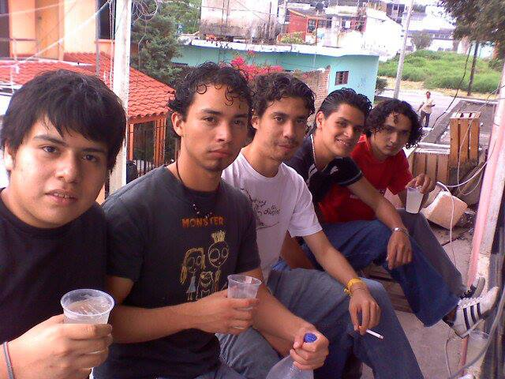
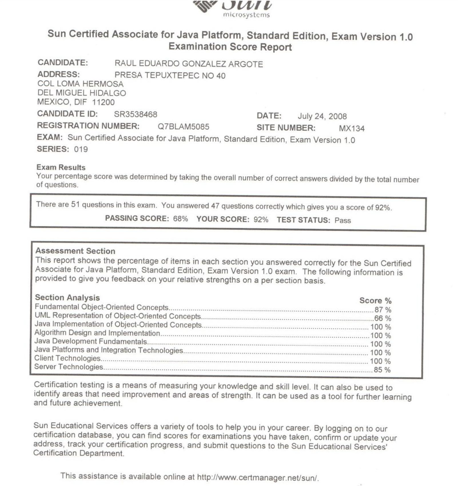
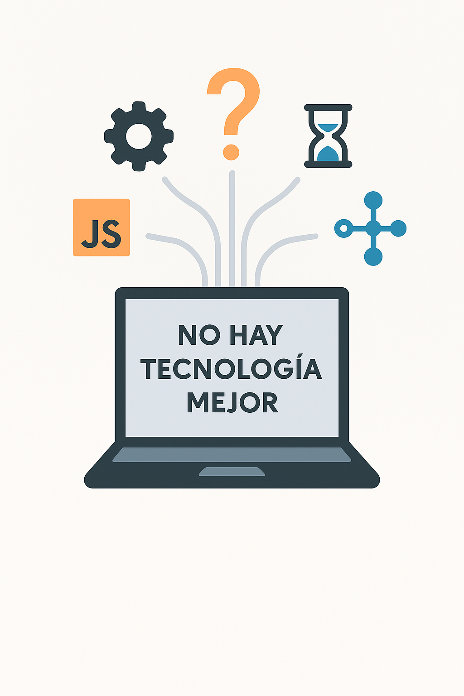
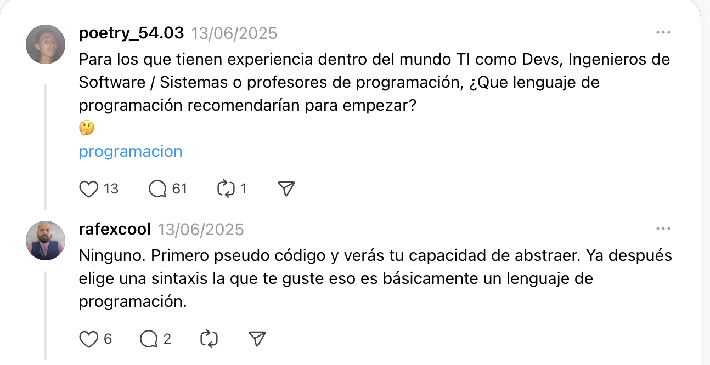
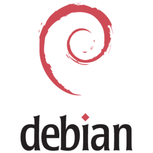
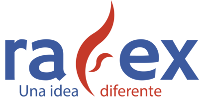

---

## Datos actuales del mundo laboral

- 📉 **Entrada incierta para recién egresados**  
  Las contrataciones para roles junior en grandes empresas han caído más del 50 % respecto a niveles pre‑pandemia; muchos graduados envían cientos de solicitudes sin respuesta  [businessinsider.com](https://www.businessinsider.com/gen-z-tech-entry-level-job-market-2025-6?utm_source=chatgpt.com).

- 🤖 **IA genera el 25 % del código en empresas como Amazon y Microsoft**  
  Herramientas de IA están reemplazando tareas rutinarias, lo cual impacta especialmente a los roles de programador junior  [economictimes.indiatimes.com](https://economictimes.indiatimes.com/news/international/global-trends/amazon-microsoft-use-ai-to-generate-25-of-their-code-will-it-take-away-jobs-of-software-engineers-in-2025/articleshow/122030620.cms?utm_source=chatgpt.com) [businessinsider.com](https://www.businessinsider.com/career-ladder-software-engineers-collapsing-ai-google-meta-coding-2025-2?utm_source=chatgpt.com).

- ⚙️ **Oferta laboral estable pero cambiante**  
  A pesar de la disminución de vacantes (–35 % desde 2020), la demanda de desarrolladores sigue creciendo a largo plazo (+17 % hasta 2033)  [businessinsider.com](https://www.businessinsider.com/jobs-software-engineers-coders-bad-market-ai-2025-3?utm_source=chatgpt.com) [lemon.io](https://lemon.io/blog/software-engineering-job-market/?utm_source=chatgpt.com).

- 🛠️ **Habilidades en demanda en 2025**  
  Las empresas buscan más que solo código: IA/machine learning, datos, DevOps, ciberseguridad y comunicación “blanda” están en auge .

---

## Agenda

1. **Bienvenida e introducción**  
   Propósito de la charla y contexto general. *(~2 min)*

2. **Panorama actual del mundo laboral**  
   Cifras, IA y tendencias que afectan la entrada al mercado. *(~3 min)*

3. **Mi historia: de estudiante a desarrollador**  
   Trayectoria universitaria, primeros proyectos y transiciones clave. *(~15 min)*

4. **Lecciones aprendidas**  
   Habilidades esenciales, valores, aprendizajes y filosofía profesional. *(~7 min)*

5. **Software libre e Inteligencia Artificial**  
   Cómo el open source y la IA marcaron mi camino. *(~5 min)*

6. **Retos, recursos y herramientas personales**  
   Montaña de crecimiento, tabla de habilidades, aprendizajes reales. *(~5 min)*

7. **Conclusiones y próximos pasos**  
   Ideas finales, contacto, y recomendaciones prácticas. *(~5 min)*

<!-- notes: Esta agenda está pensada para marcar un ritmo claro, mantener la atención del público y ayudarte a gestionar bien los tiempos durante tu ponencia. -->

---

## 1. Introducción

– Todo camino profesional tiene un inicio: el mío comenzó como **estudiante**, con más preguntas que respuestas, pero con hambre de aprender.

– Esta presentación recorre cómo pasé de esa etapa universitaria a convertirme en desarrollador y **arquitecto de TI**.

– Mi objetivo: compartir reflexiones reales que te ayuden a construir tu propio camino con base en habilidades, mentalidad y propósito.

<!-- notes: Aquí puedes hablar con sinceridad sobre cómo eras como estudiante: tus inquietudes, tus motivaciones y lo que esperabas de la carrera. Este bloque da pie a todo lo demás. -->

---

## 2. Desarrollo

## Origen – Facultad de Contaduría y Administración, Universidad Veracruzana (2007–2012)

- 🎓 Estudié la **Licenciatura en Sistemas Computacionales Administrativos**
- Mi generación: ~100 compañeros
- Un espacio de aprendizaje y comunidad
- Retos y oportunidades en un ambiente académico/laboral cambiante

<!-- notes: Mostrar cercanía con la audiencia al describir el ambiente universitario y cómo se forjó la identidad como estudiante. -->

---

# 🏆 Un momento decisivo

<!-- notes: Comenzar con una anécdota personal potente que enganche. Describir sensaciones de nervios, emoción y cómo este momento marcó un antes y un después. -->

---

## 🤔 ¿Cuál es el mejor lenguaje de programación? ¿cuál es la mejor tecnología?

---

## 🔍 ¿Cuál es el mejor lenguaje de programación? ¿cuál es la mejor tecnología?
- Pregunta común entre estudiantes y profesionales
- Respuesta: **No hay un único mejor lenguaje** o tecnología
- Lo importante es **entender los estándares** y **adaptarse a las necesidades del proyecto**
- La clave es **aprender a aprender** y **adaptarse a nuevas tecnologías**

<!-- notes: Usar un tono reflexivo. Reconocer que el cambio fue disruptivo pero terminó generando crecimiento para el ecosistema. -->

---

## 🚀 Punto de inflexión – primeros roles y conferencias

- Organicé eventos universitarios; luego pasé al rol de **ponente e instructor**
- Aprendí lo esencial: **comunicar, investigar, documentar**
- Me enfrenté al desafío de explicar ideas complejas frente al público
- Me ***"vendieron"*** como experto en una tecnología específica **Alfresco CMS** (Content Management System), en un proyecto sin experiencia previa, era recién egresado. Link de duda en un foro de preguntas y respuestas: [alfresco-cms-issue](https://connect.hyland.com/t5/alfresco-archive/crear-un-documento-sobre-una-carpeta-especifica-solucionado/td-p/184491)
- Desarrollar un **backend** consumiendo **servicios SOAP** del cuál no tenía conocimiento previo, pero con la ayuda de un compañero y mucha búsqueda en internet, logré adaptarme ***"rápidamente"***
- Desarrolle el **backend** de la nueva aplicación móvil de un banco para realizar transferencias bancarias por medio del número de celular, después de que una factoría se tirara un año en el proyecto lo entregué en **3 meses**

<!-- notes: Relatar cómo los eventos académicos se convirtieron en la puerta de entrada al mundo profesional. -->

---

## 🧰 Habilidades esenciales (y definitorias)

### 🔍 Abstracción  
Separar lo relevante del ruido, esencial para adaptarse.

### 📚 Marco teórico & comprensión  
Nunca subestimen la teoría—es la base para formular preguntas inteligentes.

### 📝 Investigación & documentación  
Sustento técnico, buenas prácticas, colaboración en equipo.

### 💡 Idea → Prototipo  
Pasar del papel al código: transformar la teoría en realidad.

<!-- notes: Desarrollar cada punto con ejemplos. Enfatizar que estas habilidades son permanentes, no modas. -->

---

## 💻 El software libre: mi punto de partida

> A lo largo de mi formación, el **software libre** fue **una puerta abierta**.  
Gracias a proyectos como **JBoss, LXC, Xen, Java, Debian, CentOS, Alfresco, Jenkins y Git**,  
pude experimentar con tecnologías que de otro modo habrían estado fuera de mi alcance por su costo.

Sin saberlo, me estaba formando no solo técnicamente, sino también bajo una filosofía de **colaboración, acceso libre al conocimiento y mejora continua**.

Hoy, en un evento centrado en el software libre, puedo decir que fue una de las **bases más importantes** de mi camino como desarrollador.

<!-- notes: Reflexionar sobre el impacto real del software libre en tu aprendizaje. Invitar a valorar y apoyar este modelo de desarrollo y conocimiento compartido. -->

---

## 🤖 Inteligencia Artificial en el desarrollo de software

- La IA ya no es futuro: es **presente** y está en producción.
- Herramientas como GitHub Copilot, ChatGPT, Amazon CodeWhisperer ya están integradas en los flujos de trabajo reales.
- En algunas empresas, **más del 25 % del código es sugerido por IA**.
- Esto no reemplaza a los desarrolladores, pero sí redefine lo que se espera de nosotros:
  - Ya no solo escribir código, sino **pensar**, abstraer, **validar**, y **conectar ideas**.

> Lo más importante que puedes hacer hoy no es competir contra la IA, sino **aprender a trabajar con ella.**

<!-- notes: Esta sección permite contextualizar a los asistentes sobre cómo la IA está cambiando el rol del desarrollador. Muestra que las habilidades humanas profundas (entendimiento, ética, abstracción) cobran más valor. -->

---

## 🏔️ Superación de retos (la montaña)

- 🎓 Del aula a la certificación → adaptación técnica
- 🎤 De organizador a ponente → superar miedo escénico
- 🧗 Entender que el camino laboral es **una montaña con varios picos y descansos**
- 🌱 **Cada reto es una oportunidad** para aprender y crecer
- 🛤️ La montaña no es lineal, pero cada paso cuenta
- 💪 La perseverancia y la adaptabilidad son claves para avanzar

<!-- notes: Usar la metáfora de la montaña para reforzar la idea de que el desarrollo profesional es progresivo y no lineal. -->

---

## 🧱 Recursos atemporales: tu kit de herramientas

| Habilidad              | Por qué importa                                  |
|------------------------|--------------------------------------------------|
| 🧠 Abstracción         | Permite diseñar sistemas claros y eficientes     |
| 📚 Teoría              | Hace que lo que aprendes se mantenga vigente     |
| 🔍 Investigación       | Da soporte a tus soluciones                      |
| 📝 Documentación       | Facilita el trabajo en equipo y el mantenimiento|
| 💡 Prototipo           | Convierte ideas en experiencia real              |
| ❤️ Gestión de emociones | **Somos seres emocionales, no somos máquinas**              |

<!-- notes: Invitar a los asistentes a reflexionar sobre cuáles de estas habilidades ya dominan y cuáles deben fortalecer. -->

---

## 🔁 Conclusión – el viaje continúa

- No importa el lenguaje o la tecnología: **estas habilidades son tu verdadero legado**
- Si hoy estás empezando, da prioridad a esas competencias más que a algo “trendy”/moda/tendencia

> Recuerda: el éxito no es un destino, es un viaje continuo de aprendizaje y adaptación
<!-- notes: Aportar autenticidad. Mostrar que el éxito viene de la constancia y el trabajo profundo, no de seguir modas. -->

---

### 📌 Mi camino sigue…

> Actualmente soy arquitecto de software y de soluciones especialista en tecnologías de **IA, automatización y cloud**. 

Además de mi rol profesional, he sido:

- 👨‍🏫 Profesor de Java y estructuras de datos  
- 🎤 Conferencista en Campus Party, FLISOL y eventos de innovación  
- 🧠 Desarrollador de soluciones con IA, procesamiento de lenguaje, herramientas open source y software libre

### 🧭 Balance entre pasión y realidad laboral

> Aprendí que no siempre vas a poder **innovar** en tu trabajo o utilizar todas las **últimas tecnologías**.

> Con el tiempo entendí que cada organización tiene **objetivos distintos a los tuyos como desarrollador**, y eso **está bien**.

> Lo importante es encontrar un **balance saludable**: si tienes un entorno laboral sano, con tiempo y autonomía, entonces puedes aportar, experimentar o construir lo que disfrutas.

> Ejemplo de eso es poder estar aquí hoy, compartiendo esta charla con ustedes.

---

## 🎯 Cierre – tu próximo paso

¿Qué puedes hacer hoy?

1. 🧠 Practica **abstracción**: desmenuza un problema en tareas básicas  
2. 📘 Refuerza tus conceptos: revisa un marco teórico que no dominas  
3. 📝 Documenta tu proceso: incluso en tus proyectos personales  
4. 🧪 Prototipo/MVP/POC: lleva tus ideas a algo tangible  
5. 🎤 Atrévete: **presenta, comparte o enseña** lo que aprendes

<!-- notes: Llamado a la acción concreto. Motivar a la audiencia a aplicar lo aprendido desde hoy mismo. -->

---

# ¡Gracias!

- 🔗 [**LinkedIn**](www.linkedin.com/in/soft-architect-raul-gonzalez) para seguir en contacto
- ✉️ [**Correo**](mailto:rafex@rafex.dev) para dudas o charlas
- 🐙 [**GitHub**](https://github.com/rafex)
- 📝 [**Blog personal The world of Rafex**](https://theworldofrafex.blog/)

<!-- notes: Agradecer y abrir espacio para preguntas. Transmitir energía positiva y disposición para dialogar. -->