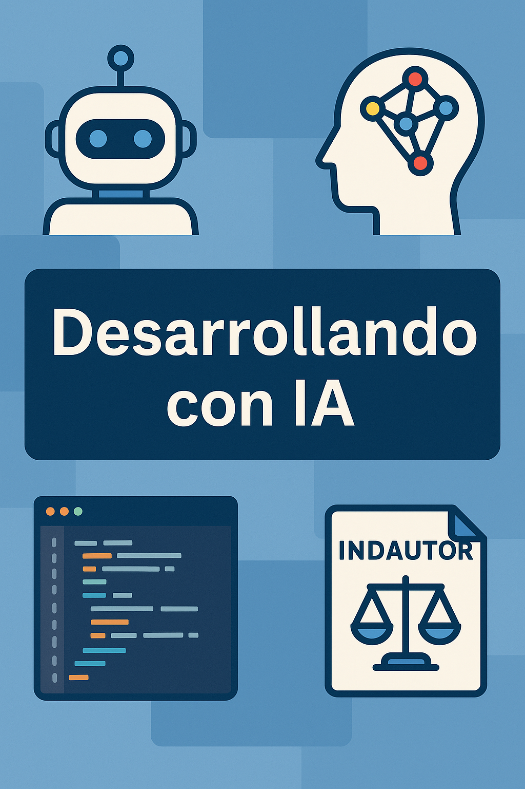

---

---

# **Introducción personal y contexto** *(~5 min)*  

   ***“Así como antes buscábamos cuál era la mejor manera de implementar un lenguaje o tecnología,*** **hoy el reto es entender cómo la IA redefine nuestro rol**”.

   
   

<!-- notes: Breve historia universitaria (UV, sistemas, comunidad). -->

---

# **Datos actuales del mundo laboral** *(~10 min)*  
   - 📉 Menos vacantes para juniors.  
   [sfstandard.com](https://sfstandard.com/2025/05/20/silicon-valley-white-collar-recession-entry-level/?utm_source=chatgpt.com) [businessinsider.com](https://www.businessinsider.com/theres-more-bad-news-for-entry-level-coders-ai-study-2025-8?utm_source=chatgpt.com)
   - 🤖 IA ya genera **20-30 % del código** en empresas líderes.  
   - ⚙️ El mercado cambia, pero siguen creciendo los perfiles con **IA/ML, datos y ciberseguridad**.  
   
   **“Esto no significa menos oportunidades, sino nuevas habilidades que aprender”.**

---

# **Tendencias y nuevas formas de programar** *(~12 min)*  
   - *Vibe coding* con **Cursor**.  
   - Agentes autónomos como **Jules**.  
   - **GitHub Copilot Agent** como copiloto corporativo.  
   - **ChatGPT** como asistente de aprendizaje.  
   
   **demo**.  
   https://github.com/rafex/prueba-chat

---

# **Implicaciones para nosotros como desarrolladores** *(~8 min)*  
   - IA no reemplaza: **potencia**.  
   - Cambia lo que significa ser dev: más **criterio, ética, supervisión y abstracción**.  
   
   **“Cuando yo inicié, pensaba en dominar un lenguaje. Hoy el valor está en cómo piensas y decides con ayuda de IA”.**  

---

# **Ética y marco legal (México y el mundo)** *(~7 min)*  
   - [INDAUTOR](https://indautor.gob.mx/comunicados.php): obras generadas **100 % por IA** no registrables.  
   - **UE, EE. UU. y China**: distintos modelos de regulación.  
   - Implicaciones en industrias (**salud, banca, videojuegos**).  
   - La **ética y la legalidad** son parte de nuestro rol como devs.  

---

# **Cierre** *(~3-4 min)*  
   - “No se trata de competir contra la IA, sino de aprender a trabajar con ella”.  
   - Balance entre **pasión y realidad laboral** → vincular con IA: encontrar espacio para experimentar, crecer y aportar con criterio humano.  
   - **Invitación a experimentar y no temer.**  

---

# ¡Gracias!

> “Tu camino no se trata solo de código, sino de conciencia, criterio y propósito.”

- 🔗 [**LinkedIn**](https://linkedin.com/in/soft-architect-raul-gonzalez) https://linkedin.com/in/soft-architect-raul-gonzalez para seguir en contacto
- ✉️ [**Correo**](mailto:rafex@rafex.dev) rafex@rafex.dev para dudas o charlas
- 🐙 [**GitHub**](https://github.com/rafex) https://github.com/rafex
- 📝 [**Blog personal The world of Rafex**](https://theworldofrafex.blog/) https://theworldofrafex.blog/

