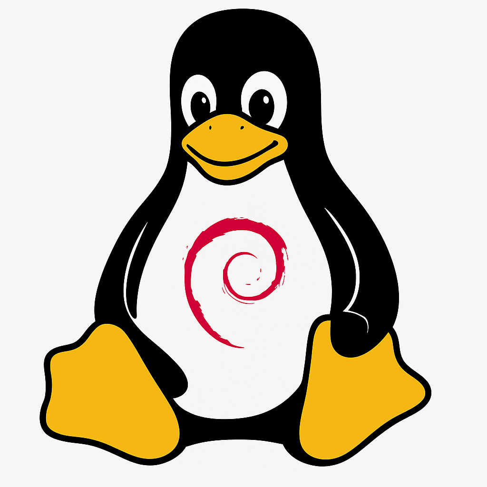
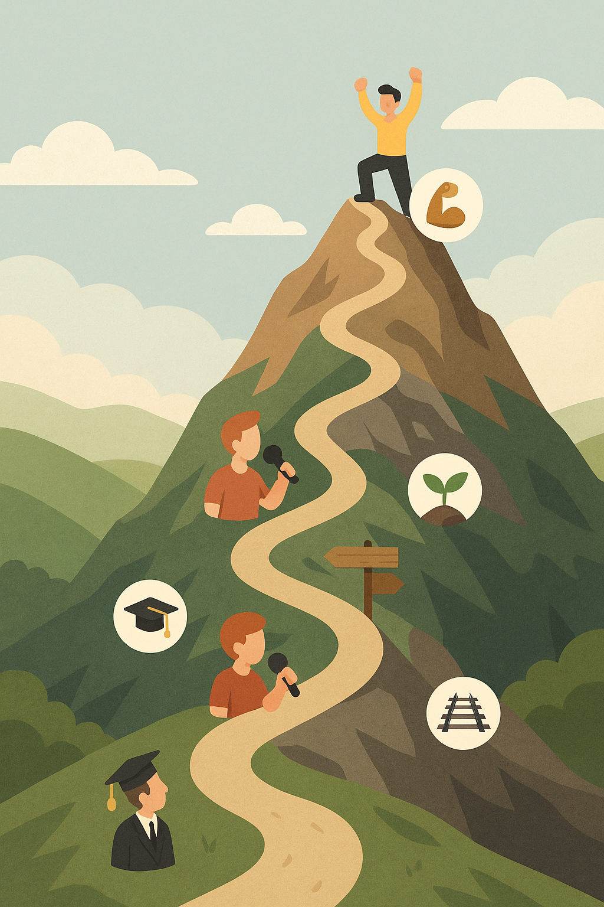

---

---

## Datos actuales del mundo laboral

- 📉 **Entrada incierta para recién egresados**  
  Las contrataciones para roles junior en grandes empresas han caído más del 50 % respecto a niveles pre‑pandemia; muchos graduados envían cientos de solicitudes sin respuesta  [businessinsider.com](https://www.businessinsider.com/gen-z-tech-entry-level-job-market-2025-6?utm_source=chatgpt.com).

- 🤖 **IA genera el 25 % del código en empresas como Amazon y Microsoft**  
  Herramientas de IA están reemplazando tareas rutinarias, lo cual impacta especialmente a los roles de programador junior  [economictimes.indiatimes.com](https://economictimes.indiatimes.com/news/international/global-trends/amazon-microsoft-use-ai-to-generate-25-of-their-code-will-it-take-away-jobs-of-software-engineers-in-2025/articleshow/122030620.cms?utm_source=chatgpt.com) [businessinsider.com](https://www.businessinsider.com/career-ladder-software-engineers-collapsing-ai-google-meta-coding-2025-2?utm_source=chatgpt.com).

- ⚙️ **Oferta laboral estable pero cambiante**  
  A pesar de la disminución de vacantes (–35 % desde 2020), la demanda de desarrolladores sigue creciendo a largo plazo (+17 % hasta 2033)  [businessinsider.com](https://www.businessinsider.com/jobs-software-engineers-coders-bad-market-ai-2025-3?utm_source=chatgpt.com) [lemon.io](https://lemon.io/blog/software-engineering-job-market/?utm_source=chatgpt.com).

- 🛠️ **Habilidades en demanda en 2025**  
  Las empresas buscan más que solo código: IA/machine learning, datos, DevOps, ciberseguridad y comunicación “blanda” están en auge .

---

## Agenda

1. **Introducción y contexto actual**  
   ¿Quién soy y qué está ocurriendo en el mundo del desarrollo? *(~5 min)*

2. **Primeros pasos y punto de inflexión**  
   De la universidad a mis primeros roles reales. *(~10 min)*

3. **Tecnología con propósito**  
   El valor del software libre y el impacto de la IA. *(~8 min)*

4. **Retos, habilidades y balance profesional**  
   La montaña, los aprendizajes y cómo encontrar tu lugar. *(~8 min)*

5. **Conclusión e inspiración final**  
   Herramientas atemporales y próximos pasos. *(~4 min)*

<!-- notes: Agenda condensada en cinco secciones más amplias para enfocar mejor la atención del público y mantener claridad estructural durante la charla. -->

---

## 1. Introducción

– Todo camino profesional tiene un inicio: el mío comenzó como **estudiante**, con más preguntas que respuestas, pero con hambre de aprender.

– Esta presentación recorre cómo pasé de esa etapa universitaria a convertirme en desarrollador y **arquitecto de TI**.

– Mi objetivo: compartir reflexiones reales que te ayuden a construir tu propio camino con base en habilidades, mentalidad y propósito.

<!-- notes: Aquí puedes hablar con sinceridad sobre cómo eras como estudiante: tus inquietudes, tus motivaciones y lo que esperabas de la carrera. Este bloque da pie a todo lo demás. -->

---

## 2. Desarrollo

## Origen – Facultad de Contaduría y Administración, Universidad Veracruzana (2007–2012)

- 🎓 Estudié la **Licenciatura en Sistemas Computacionales Administrativos**
- Mi generación: ~100 compañeros
- Un espacio de aprendizaje y comunidad
- Retos y oportunidades en un ambiente académico/laboral cambiante

<!-- notes: Mostrar cercanía con la audiencia al describir el ambiente universitario y cómo se forjó la identidad como estudiante. -->

---

# 🏆 Un momento decisivo

<!-- notes: Comenzar con una anécdota personal potente que enganche. Describir sensaciones de nervios, emoción y cómo este momento marcó un antes y un después. -->

---

## 🤔 ¿Cuál es la mejor tecnología?

---

## 🤔 ¿Cuál es el mejor lenguaje de programación?

- Pregunta común entre estudiantes y profesionales
- Respuesta: **No hay un único mejor lenguaje** o tecnología

<!-- notes: Usar un tono reflexivo. Reconocer que el cambio fue disruptivo pero terminó generando crecimiento para el ecosistema. -->

---

## 🚀 Punto de inflexión – primeros pasos...

- Organicé eventos universitarios; luego pasé al rol de **ponente e instructor** enfrenté al desafío de explicar ideas complejas frente al público
- Me ***"vendieron"*** como experto en una tecnología específica **Alfresco CMS** (Content Management System), en un proyecto sin experiencia previa, era recién egresado. [alfresco-cms-issue](https://connect.hyland.com/t5/alfresco-archive/crear-un-documento-sobre-una-carpeta-especifica-solucionado/td-p/184491)
- Desarrollé un **backend** consumiendo **servicios SOAP** sin conocimiento previo, pero con la ayuda de un compañero y mucha búsqueda en internet, me adapté ***"rápidamente"***
- Desarrollé el **backend** de una aplicación móvil para banco que realizaba operaciones con solo tener el número de celular

<!-- notes: Relatar cómo los eventos académicos se convirtieron en la puerta de entrada al mundo profesional. -->

---

## 💻 El software libre: mi punto de partida

> A lo largo de mi formación, el **software libre** fue **una puerta abierta**.  
Gracias a proyectos como **JBoss, LXC, Xen, Java, Debian, CentOS, Alfresco, Jenkins y Git**,  
pude experimentar con tecnologías que de otro modo habrían estado fuera de mi alcance por su costo.

Sin saberlo, me estaba formando no solo técnicamente, sino también bajo una filosofía de **colaboración, acceso libre al conocimiento y mejora continua**.

Hoy, en un evento centrado en el software libre, puedo decir que fue una de las **bases más importantes** de mi camino como desarrollador.

<!-- notes: Reflexionar sobre el impacto real del software libre en tu aprendizaje. Invitar a valorar y apoyar este modelo de desarrollo y conocimiento compartido. -->

---

## 🤖 Inteligencia Artificial en el desarrollo de software

- La IA ya no es futuro: es **presente** y está en producción.
- Herramientas como GitHub Copilot, ChatGPT, Amazon CodeWhisperer ya están integradas en los flujos de trabajo reales.
- En algunas empresas, **más del 25 % del código es sugerido por IA**.
- Esto no reemplaza a los desarrolladores, pero sí redefine lo que se espera de nosotros:
  - Ya no solo escribir código, sino **pensar**, abstraer, **validar**, y **conectar ideas**.

> Lo más importante que puedes hacer hoy no es competir contra la IA, sino **aprender a trabajar con ella.**

<!-- notes: Esta sección permite contextualizar a los asistentes sobre cómo la IA está cambiando el rol del desarrollador. Muestra que las habilidades humanas profundas (entendimiento, ética, abstracción) cobran más valor. -->

---

## 🏔️ Superación de retos (la montaña)

- 🎓 Del aula a la certificación → adaptación técnica
- 🎤 De organizador a ponente → superar miedo escénico
- 🧗 Entender que el camino laboral es **una montaña con varios picos y descansos**
- 🌱 **Cada reto es una oportunidad** para aprender y crecer
- 🛤️ La montaña no es lineal, pero cada paso cuenta
- 💪 La perseverancia y la adaptabilidad son claves para avanzar

<!-- notes: Usar la metáfora de la montaña para reforzar la idea de que el desarrollo profesional es progresivo y no lineal. -->

---

### 🧭 Balance entre pasión y realidad laboral

> Aprendí que no siempre vas a poder **innovar** en tu trabajo o utilizar todas las **últimas tecnologías**.

> Con el tiempo entendí que cada organización tiene **objetivos distintos a los tuyos como profesional**, y eso **está bien**.

> Lo importante es encontrar un **balance**: si tienes un entorno laboral saludable, con tiempo y autonomía, entonces puedes aportar, experimentar o construir lo que disfrutas.

> Ejemplo de eso es poder estar aquí hoy, compartiendo esta charla con ustedes.

---

## 🧱 Recursos atemporales: tu kit de herramientas

| Habilidad              | Por qué importa                                  |
|------------------------|--------------------------------------------------|
| 🧠 Abstracción         | Permite diseñar sistemas claros y eficientes     |
| 📚 Teoría              | Hace que lo que aprendes se mantenga vigente     |
| 🔍 Investigación       | Da soporte a tus soluciones                      |
| 📝 Documentación       | Facilita el trabajo en equipo y el mantenimiento|
| 💡 Prototipo           | Convierte ideas en experiencia real              |
| ❤️ Gestión de emociones | **Somos seres emocionales, no somos máquinas**              |

<!-- notes: Invitar a los asistentes a reflexionar sobre cuáles de estas habilidades ya dominan y cuáles deben fortalecer. -->

---

## 🎯 El viaje continúa y tus próximo paso

> No importa el lenguaje o la tecnología: **las habilidades son tu verdadero legado**

¿Qué puedes hacer hoy?

1. 🧠 Practica **abstracción**: desmenuza un problema en tareas básicas  
2. 📘 Refuerza tus conceptos: revisa un marco teórico que no dominas  
3. 📝 Documenta tu proceso: incluso en tus proyectos personales  
4. 🧪 Prototipo/MVP/POC: lleva tus ideas a algo tangible  
5. 🎤 Atrévete: **presenta, comparte o enseña** lo que aprendes

<!-- notes: Llamado a la acción concreto. Motivar a la audiencia a aplicar lo aprendido desde hoy mismo. -->

---

## Bonus: Crear un CV

- **concentra tus habilidades y experiencias** en un formato claro para la posición que buscas
- **destaca tus proyectos personales** y contribuciones a software libre
- **mantén un portafolio actualizado** con ejemplos de tu trabajo

---

# ¡Gracias!

> “Tu camino no se trata solo de código, sino de conciencia, criterio y propósito.”

- 🔗 [**LinkedIn**](www.linkedin.com/in/soft-architect-raul-gonzalez) para seguir en contacto
- ✉️ [**Correo**](mailto:rafex@rafex.dev) para dudas o charlas
- 🐙 [**GitHub**](https://github.com/rafex)
- 📝 [**Blog personal The world of Rafex**](https://theworldofrafex.blog/)

<!-- notes: Agradecer y abrir espacio para preguntas. Transmitir energía positiva y disposición para dialogar. -->
