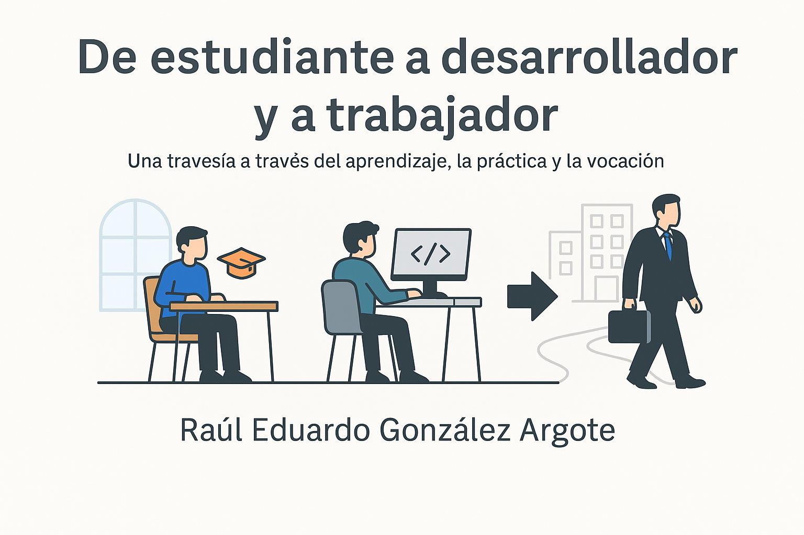
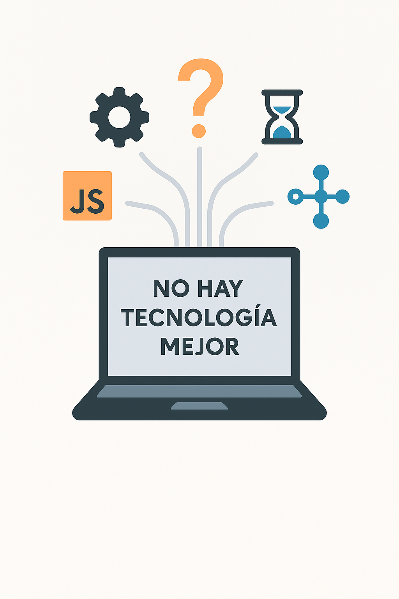
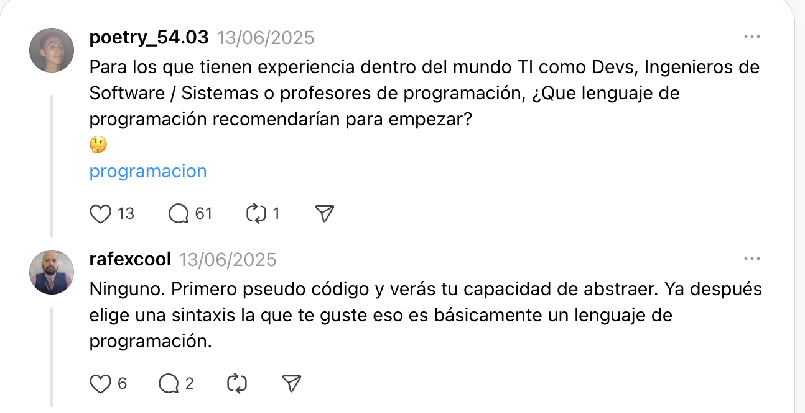
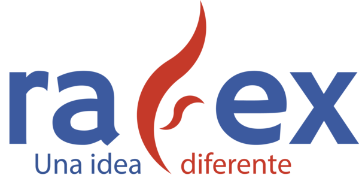

---

---

## Datos actuales del mundo laboral

- 📉 **Entrada incierta para recién egresados**  
  La contratación de graduados en grandes tecnológicas ha caído más de **50 % desde niveles pre‑pandemia**, y en general los empleos de nivel inicial se han reducido con la llegada de la IA. Algunos estudios señalan que los jóvenes (22–25 años) enfrentan hasta un **13 % menos oportunidades** en roles expuestos a la automatización. [sfstandard.com](https://sfstandard.com/2025/05/20/silicon-valley-white-collar-recession-entry-level/?utm_source=chatgpt.com) [businessinsider.com](https://www.businessinsider.com/theres-more-bad-news-for-entry-level-coders-ai-study-2025-8?utm_source=chatgpt.com)

- 🤖 **IA genera entre 20 % y 30 % del código en empresas líderes**  
  Microsoft ha reportado que hasta un **30 % de su código interno** es generado por IA, y medios señalan cifras similares en Amazon. Esto impacta especialmente a roles junior, pues las tareas rutinarias son automatizadas. [techcrunch.com](https://techcrunch.com/2025/04/29/microsoft-ceo-says-up-to-30-of-the-companys-code-was-written-by-ai/?utm_source=chatgpt.com) [economictimes.indiatimes.com](https://m.economictimes.com/news/international/global-trends/amazon-microsoft-use-ai-to-generate-25-of-their-code-will-it-take-away-jobs-of-software-engineers-in-2025/articleshow/122030620.cms?utm_source=chatgpt.com)

---

## Datos actuales del mundo laboral

- ⚙️ **Oferta laboral estable pero cambiante**  
  Aunque hay una reducción en vacantes de entrada, la demanda global de desarrolladores sigue creciendo a largo plazo, con una proyección de **+17 % hasta 2033**. Los perfiles más buscados incluyen IA, machine learning, datos, DevOps y ciberseguridad. [lemon.io](https://lemon.io/blog/software-engineering-job-market/?utm_source=chatgpt.com)

- 🛠️ **Habilidades en demanda en 2025**  
  Las empresas buscan más que solo código: IA/machine learning, datos, DevOps, ciberseguridad y comunicación “blanda” están en auge .

---

### 📊 Tendencias y cambios recientes

1. **Alta adopción de IA en ingeniería de software**  
   - En el *Informe DORA 2025*, se señala que muchas organizaciones ya usan herramientas de desarrollo asistido por IA.  
   - Hasta un **90 % de los equipos de desarrollo** han integrado IA en procesos de código, documentación, pruebas, etc.  
   - En el sector TI, un **97 % de los trabajadores** usan herramientas generativas (ChatGPT y similares), con mejoras en productividad pero preocupaciones de seguridad laboral.  

2. **Productividad y ROI todavía en exploración**  
   - Muchas empresas hacen pilotos, pero los beneficios reales requieren **reestructurar procesos completos**, no solo codificación.  
   - Las mejoras de productividad rondan el **10‑15 %**, sin siempre traducirse en retorno económico si revisión e integración siguen lentas.  
   - Un experimento con desarrolladores open source mostró que en algunos casos la IA tomó **19 % más tiempo** para completar tareas.  

---

### 📊 Tendencias y cambios recientes

3. **Nuevas formas de codificación: “Vibe Coding”**  
   - Surge el concepto *vibe coding* (popularizado por Andrej Karpathy): el desarrollador describe lo que quiere y la IA genera iterativamente el código.  
   - Herramientas como **Cursor (Anysphere)** se posicionan como plataformas de *vibe coding*, integrando IDE + modelos IA para desarrollo por prompts.  

4. **Herramientas especializadas y agentes para DevOps / SRE**  
   - La startup **Ciroos** lanzó “AI SRE Teammate”, un agente especializado en incidentes, monitoreo y operaciones.  
   - Atlassian adquirió **DX**, plataforma de inteligencia de desarrolladores que mide eficiencia, adopción de herramientas y métricas de equipo.  

5. **Impacto en empleo y roles**  
   - Disminuyen vacantes de nivel inicial: tareas rutinarias ya pueden ser asistidas por IA.  
   - Surgen nuevos roles híbridos: desarrolladores que **supervisan agentes, gestionan prompts, validan salidas y automatizan** tareas.  
   - La IA no elimina desarrolladores: redefine competencias, dando más valor al **juicio, diseño e integración** que a solo escribir código.

---

## Agenda

1. **Introducción y contexto actual**  
   ¿Quién soy y qué está ocurriendo en el mundo del desarrollo? *(~5 min)*

2. **La IA ya no es el futuro, es el presente**  
   Utilizar la IA como herramienta que potencie nuestras capacidades. *(~10 min)*

3. **Tecnología con propósito**  
   El impacto de la IA sus beneficios y posibles malas impresiones. *(~8 min)*

4. **¿Cómo se usa la IA en el desarrollo?**  
   Mostrar ChatGPT, Jolues Google, Copilot Github, Void Editor, Cursor. *(~8 min)*

5. **Conclusión e inspiración final**  
   Próximos pasos. *(~4 min)*

<!-- notes: Agenda condensada en cinco secciones más amplias para enfocar mejor la atención del público y mantener claridad estructural durante la charla. -->

---

## 1. Introducción

<!-- notes:  -->

---

## 2. Desarrollo

## Origen – Facultad de Contaduría y Administración, Universidad Veracruzana (2007–2012)

- 🎓 Estudié la **Licenciatura en Sistemas Computacionales Administrativos**
- Mi generación: ~100 compañeros
- Un espacio de aprendizaje y comunidad
- Retos y oportunidades en un ambiente académico/laboral cambiante

<!-- notes: Mostrar cercanía con la audiencia al describir el ambiente universitario y cómo se forjó la identidad como estudiante. -->

---

## 🤔 ¿Cuál es la mejor tecnología?

---

## 🤔 ¿Cuál es el mejor lenguaje de programación?

- Pregunta común entre estudiantes y profesionales
- Respuesta: **No hay un único mejor lenguaje** o tecnología

<!-- notes: Usar un tono reflexivo. Reconocer que el cambio fue disruptivo pero terminó generando crecimiento para el ecosistema. -->

## 🤖 Inteligencia Artificial en el desarrollo de software

- La IA ya no es futuro: es **presente** y está en producción.
- Herramientas como GitHub Copilot, ChatGPT, Amazon CodeWhisperer ya están integradas en los flujos de trabajo reales.
- En algunas empresas, **más del 25 % del código es sugerido por IA**.
- Esto no reemplaza a los desarrolladores, pero sí redefine lo que se espera de nosotros:
  - Ya no solo escribir código, sino **pensar**, abstraer, **validar**, y **conectar ideas**.

> Lo más importante que puedes hacer hoy no es competir contra la IA, sino **aprender a trabajar con ella.**

<!-- notes: Esta sección permite contextualizar a los asistentes sobre cómo la IA está cambiando el rol del desarrollador. Muestra que las habilidades humanas profundas (entendimiento, ética, abstracción) cobran más valor. -->

---

### 🧭 Balance entre pasión y realidad laboral

> Aprendí que no siempre vas a poder **innovar** en tu trabajo o utilizar todas las **últimas tecnologías**.

> Con el tiempo entendí que cada organización tiene **objetivos distintos a los tuyos como profesional**, y eso **está bien**.

> Lo importante es encontrar un **balance**: si tienes un entorno laboral saludable, con tiempo y autonomía, entonces puedes aportar, experimentar o construir lo que disfrutas.

> Ejemplo de eso es poder estar aquí hoy, compartiendo esta charla con ustedes.

---

---

## Temas relevantes sobre IA en **INDAUTOR**

1. **Obras creadas completamente por IA no registrables**  
   **INDAUTOR** ha publicado que la **Suprema Corte de Justicia de la Nación (SCJN)** resolvió que las obras generadas exclusivamente por sistemas de **IA** no pueden registrarse bajo el régimen de **derechos de autor** en México.  
   En un comunicado oficial, **INDAUTOR** reconoce esta decisión y la integra como **criterio institucional**.  

2. **Documentos y análisis sobre IA y derecho de autor**  
   - *“**Inteligencia artificial. El futuro en el derecho de autor**”* es un documento de **INDAUTOR** que explora los **retos legales** de la IA frente al derecho de autor.  
   - *“**Inteligencia artificial y derechos de autor (IA-OMPI)**”* es otro documento que analiza cómo funcionan las **leyes de IA** desde la perspectiva de la **OMPI** y su implicación en México.  
   - También hay documentos más específicos, como uno que trata de la plataforma **Lanteri IA** en México y su relación con **derechos de autor**.  

3. **Convocatorias que incorporan IA generativa**  
   En la convocatoria del **Premio Nacional de Administración 2025**, hay mención explícita de que pueden participar tecnologías que usen modelos de **Inteligencia Artificial Generativa (IAG)** para creación de contenido (texto, imágenes).  

4. **Impacto en la creatividad computacional / industria de videojuegos**  
   En **webinars de INDAUTOR** relacionados con **videojuegos** como industria, se ha discutido el uso de **IA** y **creatividad computacional** como parte de la **innovación de contenido**.  

5. **Tesis y normatividad universitaria**  
   En la sección de **tesis** del sitio, **INDAUTOR** también menciona “**inteligencia artificial**” en algunos trabajos o contextos de investigación, mostrando que el ámbito **académico** también se cruza con las decisiones de **derechos de autor**.  

---

💡 **Ideas para usar esto en tu conferencia**  
- Puedes incluir una sección breve sobre **derechos de autor y AI en México**, mostrando cómo la **legislación** está respondiendo al desafío de las obras generadas por IA.  
- Un contraste interesante: **Japón, EE. UU. y la UE** tienen posiciones diversas sobre **autoría de IA**; mostrar que en México la postura actual (a nivel institucional) es que solo obras con **intervención humana significativa** puedan registrarse.  
- Relacionarlo con tu **demo**: si usas **Jules** o **Copilot** para generar código/documentación, ¿cómo se aplica en México respecto a quién “posee” ese contenido?  
- También usar la **convocatoria del Premio Nacional** como ejemplo de que ya se están reconociendo usos de **IA generativa** en prácticas institucionales.  

---

# ¡Gracias!

> “Tu camino no se trata solo de código, sino de conciencia, criterio y propósito.”

- 🔗 [**LinkedIn**](https://linkedin.com/in/soft-architect-raul-gonzalez) https://linkedin.com/in/soft-architect-raul-gonzalez para seguir en contacto
- ✉️ [**Correo**](mailto:rafex@rafex.dev) rafex@rafex.dev para dudas o charlas
- 🐙 [**GitHub**](https://github.com/rafex) https://github.com/rafex
- 📝 [**Blog personal The world of Rafex**](https://theworldofrafex.blog/) https://theworldofrafex.blog/

<!-- notes: Agradecer y abrir espacio para preguntas. Transmitir energía positiva y disposición para dialogar. -->
