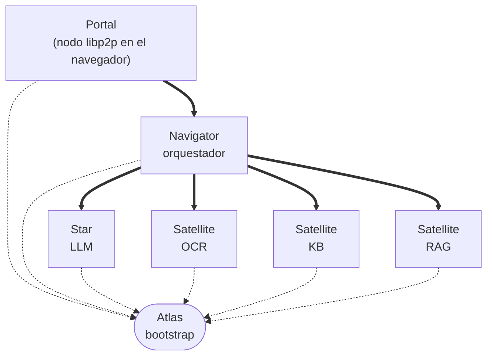
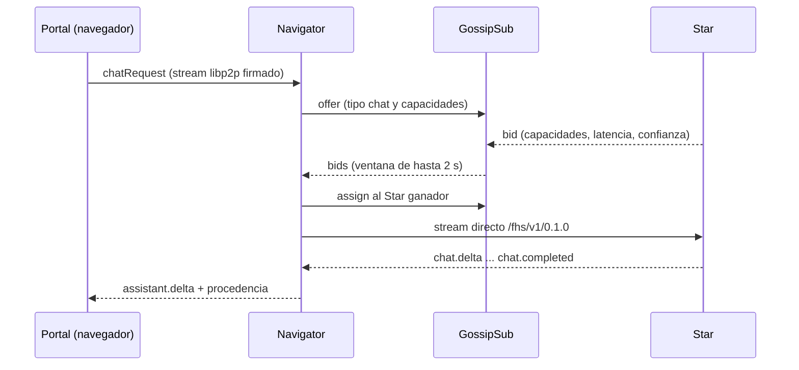
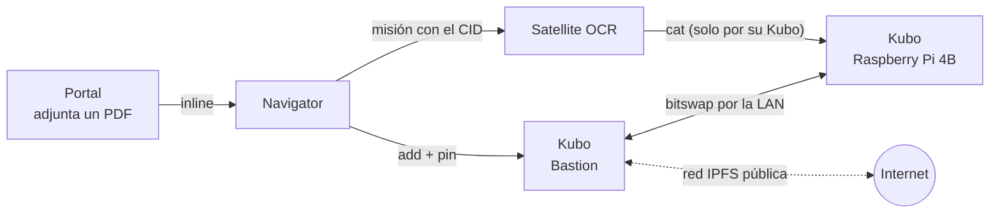

# galaxIA

## De una idea a una red: por qué nació, cómo cambió en tres meses y cómo puedes sumarte

<div class="cover-meta">Charla · 45 min · público técnico y estudiantes</div>

<!--
Notas del orador:
- Esta es la segunda charla de galaxIA. La primera fue el 3 de julio de 2026 ("Reutiliza tus equipos viejos para una red soberana e IA"); hoy contamos qué pasó desde entonces.
- Ritmo: ~35 min de charla y ~10 de preguntas. Hay slides de respaldo al final por si alguien pide más detalle.
- Todo lo que se llama "snapshot" viene de mi laboratorio del 27-28 de septiembre de 2026: es una observación propia, no un release estable.

[Sources]
https://github.com/rafex/presentaciones-cursos-talleres/tree/main/presentaciones/red-soberana-de-ia
-->

---

# Ruta de hoy

<div class="cards four">
<div class="card"><h3>1 · Por qué nació</h3><p>El problema y la pregunta que dieron origen a galaxIA.</p></div>
<div class="card violet"><h3>2 · De dónde partimos</h3><p>La primera charla, 3 de julio: qué mostramos y qué prometimos.</p></div>
<div class="card green"><h3>3 · Cómo cambió</h3><p>De un Registry central a una red P2P, y de TypeScript a Rust.</p></div>
<div class="card amber"><h3>4 · Retos y cómo sumarte</h3><p>Lo que falta y cinco caminos concretos para ayudar.</p></div>
</div>

<div class="callout" style="margin-top:1.6rem">Al final: <b>~10 min de preguntas</b>. Si algo se quedó corto, hay slides de respaldo.</div>

<!--
Notas del orador:
- Cuatro bloques. Los tiempos aproximados: 9 min el origen y el punto de partida, 12 min la evolución, 7 min los retos, 5 min cómo sumarse, ~10 min de preguntas.
- Aviso al público técnico: habrá IPs, puertos y versiones reales del laboratorio; al público de estudiantes: nada de eso es necesario para seguir la historia.
-->

---
class: section-slide
---

<div class="kicker">Acto 1</div>

# Por qué nació

Un problema, una pregunta y una apuesta.

<!--
Notas del orador:
- Pausa breve. Este bloque es corto: el origen en tres ideas.
-->

---

# La IA útil se concentró

<div class="two-wide">
<div>

ChatGPT, Claude y Gemini son herramientas **excelentes**, pero centralizadas:

- Un solo proveedor decide **disponibilidad** y **precio**.
- Tus datos viven **en su servidor**.
- Si el servicio cambia o desaparece, **te quedas sin nada**.

<div class="callout warn">No es una crítica a esas herramientas: es una <b>dependencia</b> que la mayoría no eligió conscientemente.</div>

</div>
<div class="figure">



</div>
</div>

<!--
Notas del orador:
- Pregunta al público: "¿cuántos usaron una IA en la última semana? ¿cuántos saben dónde se guardan sus conversaciones?".
- Idea central: no se trata de rechazar la nube, sino de notar que hoy casi no hay alternativa organizada para una comunidad pequeña.

[Sources]
Primera charla, slide "El modelo de nube tradicional": https://github.com/rafex/presentaciones-cursos-talleres/tree/main/presentaciones/red-soberana-de-ia
-->

---
class: statement-slide
---

# Mientras tanto, hay hardware que ya nadie usa

<div class="big-quote">Laptops de oficina, mini-PC, una Raspberry Pi en un cajón. <span>¿Y si una comunidad pudiera armar su propia IA con lo que ya tiene?</span></div>

<!--
Notas del orador:
- Aquí nace la apuesta: el hardware modesto no es el caso raro, es el caso base. Todo el diseño parte de eso: nada de GPU obligatoria, nada de servidores dedicados.
- Deja la pregunta en pantalla unos segundos antes de avanzar.

[Sources]
https://github.com/rafex/galaxIA/blob/main/README.md
-->

---

# La pregunta

<div class="two-wide">
<div>

¿Cómo sería una IA útil **para tu escuela, tu equipo o tu colectivo**…

- **sin mandar tus datos** a un tercero,
- **sin pagar** una suscripción,
- **sin depender** de que ese servicio siga existiendo mañana?

**La respuesta de galaxIA:** una red donde cada equipo aporta *una capacidad distinta* y **nadie es dueño de toda la red**.

</div>
<div class="figure">



</div>
</div>

<!--
Notas del orador:
- Este es el cambio de modelo mental: no reemplazar a un proveedor por otro, sino no depender de ningún proveedor único.
- Cada nodo es de alguien distinto: el tuyo, el de un vecino, el de la comunidad.

[Sources]
Primera charla, slide "La alternativa: red soberana federada": https://github.com/rafex/presentaciones-cursos-talleres/tree/main/presentaciones/red-soberana-de-ia
-->

---

# Lo que queríamos que fuera verdad

<div class="cards two-col">
<div class="card"><h3>Con el hardware que ya existe</h3><p>Sin presupuesto nuevo: lo modesto es el caso base, no la excepción.</p></div>
<div class="card violet"><h3>Sin ceder el control de los datos</h3><p>Cada nodo decide qué guarda y a quién responde.</p></div>
<div class="card green"><h3>Sumarse sin pedir permiso</h3><p>Cualquiera aporta un nodo si cumple el contrato del protocolo.</p></div>
<div class="card amber"><h3>Privacidad dentro del protocolo</h3><p>No un aviso legal: <code>scope</code>, <code>retention</code> y <code>provenance</code> viajan en cada mensaje.</p></div>
</div>

<!--
Notas del orador:
- Cuatro principios que siguen en pie tres meses después. Veremos cuáles se cumplieron y cuáles siguen siendo reto.
- `scope` limita quién puede resolver tu petición (local, network, community, external); `retention` dice qué hace cada nodo con tus datos; `provenance` deja constancia de qué modelo razonó y a dónde viajaron los datos.

[Sources]
https://github.com/rafex/galaxIA/blob/main/docs/trust.md
https://github.com/rafex/presentaciones-cursos-talleres/tree/main/presentaciones/red-soberana-de-ia
-->

---

# El nombre y su vocabulario

`galaxIA` = *galaxy* + *IA*. Los roles siguen la metáfora:

<div class="dense">

| Concepto técnico | Nombre galaxIA | Qué hace |
|---|---|---|
| Nodo que razona (LLM) | **Star** | Genera las respuestas |
| Nodo con una herramienta | **Satellite** | OCR, base de conocimiento, RAG… |
| Nodo con su propio ciclo de razonamiento | **Nova** | Razona en varias rondas antes de responder |
| Punto de entrada al swarm | **Atlas** | Ayuda a un nodo nuevo a encontrar la red |
| Orquestador | **Navigator** | Elige qué Star y qué Satellites usar |
| Anuncio de capacidades | **Beacon** | Lo que un nodo dice que sabe hacer |
| Tarea enviada a un nodo | **Mission** | Una petición de chat o de herramienta |
| Chat web | **Portal** | La entrada humana a la red |

</div>

<!--
Notas del orador:
- No hace falta memorizarlo: reaparece en los diagramas. Lo esencial: Star razona, Satellite ejecuta una capacidad, Navigator decide quién hace qué, Atlas solo ayuda a entrar.
- Aclara que "Atlas" ya no es un registro central (eso cambia en el Acto 2).
- Nova existe en el diseño, pero no está desplegada en el laboratorio actual.

[Sources]
https://github.com/rafex/galaxIA/blob/main/docs/vocabulario.md
-->

---

<div class="kicker">Punto de partida · 3 de julio de 2026</div>

# La primera charla: tres equipos y un Registry

<div class="two">
<div class="figure">



</div>
<div>

**El hardware**

- Router TP-Link con OpenWrt (`192.168.1.0/24`)
- Laptop i5 · Debian 13 → *Registry + chat*
- Bastion i7 · Debian 13 → *LLM con llama.cpp*
- Raspberry Pi 4B · DietPi → *OCR con Tesseract*

**El protocolo**

- JSON sobre WebSocket
- Un **Registry central**: `hello → register → heartbeat` cada 10 s
- SDK solo en TypeScript

</div>
</div>

<!--
Notas del orador:
- Esa fue la demo: tres equipos, tres roles, una sola red. Funcionaba de punta a punta con hardware real y heterogéneo, pero todo pasaba por el Registry de la laptop.
- El Registry nunca iniciaba la conexión: el nodo llegaba primero. Eso permitía redes asimétricas, pero también dejaba un punto único de falla.

[Sources]
https://github.com/rafex/presentaciones-cursos-talleres/tree/main/presentaciones/red-soberana-de-ia
-->

---

# Así se veía la red

<div class="figure">



</div>

<div class="callout warn">Todo dependía de <b>un Registry central</b>: si la laptop caía, la red dejaba de existir.</div>

<!--
Notas del orador:
- Este diagrama es el "antes". Recuérdenlo: en el Acto 2 lo comparamos con el "después".
- Los tres mensajes `hello / register / ping` eran el pegamento de esa versión; hoy ya no existen en el protocolo.

[Sources]
https://github.com/rafex/presentaciones-cursos-talleres/tree/main/presentaciones/red-soberana-de-ia
-->

---

# Lo que prometimos en «Qué sigue»

<div class="cards four">
<div class="card"><h3>SDKs en más lenguajes</h3><p>Rust, Python y Java: "hoy solo hay TypeScript".</p></div>
<div class="card violet"><h3>Identidad criptográfica real</h3><p>Ed25519 en lugar del DID simplificado.</p></div>
<div class="card green"><h3>Descubrimiento descentralizado</h3><p>Reemplazar el Registry central por mDNS/DHT.</p></div>
<div class="card amber"><h3>Confianza comunitaria</h3><p>Reputación, vetos y políticas de privacidad más finas.</p></div>
</div>

<div class="callout" style="margin-top:1.6rem">Guarda estas cuatro promesas: <b>las revisamos al final del Acto 2</b>.</div>

<!--
Notas del orador:
- Esta fue literalmente la última slide de contenido de la primera charla. La usamos como checklist honesto: ¿qué cumplimos en tres meses?
- No adelantes el resultado; en el Acto 2 hay una slide donde se marca cada una.

[Sources]
https://github.com/rafex/presentaciones-cursos-talleres/tree/main/presentaciones/red-soberana-de-ia
-->

---
class: section-slide
---

<div class="kicker">Acto 2</div>

# Cómo cambió

Del 30 de junio a hoy: del Registry central a una red P2P, y de TypeScript a Rust.

<!--
Notas del orador:
- Este es el bloque más largo (~12 min). Hilo conductor: cada cambio responde a una limitación de la primera versión.
-->

---

<div class="kicker">Tres meses en una línea</div>

# Del 30 de junio a hoy

<ul class="timeline">
<li><span class="d">30 jun</span><span>Nace <b>galaxIA</b>: el repositorio del protocolo</span></li>
<li><span class="d">3 jul</span><span>Primera charla: 3 equipos y un Registry central</span></li>
<li><span class="d">5–6 jul</span><span>Vocabulario Star / Satellite y separación de repositorios (DEC-0024, DEC-0038)</span></li>
<li><span class="d">2 ago</span><span>TypeScript valida el protocolo; <b>Rust es el destino</b> (DEC-0088)</span></li>
<li><span class="d">3 ago</span><span><b>libp2p-only</b> y <b>Protobuf-only</b>: se eliminan WebSocket JSON y el Registry (DEC-0090, DEC-0091)</span></li>
<li><span class="d">4 ago</span><span>El navegador entra a la red como un nodo libp2p más</span></li>
<li><span class="d">27 sep</span><span><b>Todo el backend en Rust</b>: Atlas, Navigator, Star, OCR, KB y RAG</span></li>
<li class="now"><span class="d">27 sep</span><span><b>Adjuntos por IPFS</b> en la red pública (DEC-0095)</span></li>
</ul>

<div class="tiny" style="margin-top:0.8rem">263 commits en el repo del protocolo · 7 repositorios públicos en total</div>

<!--
Notas del orador:
- Las decisiones (DEC-xxxx) están numeradas y fechadas en el repo: cada cambio grande tiene su porqué escrito.
- Lo importante: el 2 y 3 de agosto se tomó la decisión más fuerte: no mantener retrocompatibilidad con el modelo hello/register/ping. Se eliminó en lugar de convivir con él.
- La migración a Rust fue después: primero se validó el protocolo en TypeScript, luego se reescribió el backend con fixtures dorados generados desde el TS.

[Sources]
https://github.com/rafex/galaxIA/blob/main/spec-native/DECISIONS.md
https://github.com/rafex/galaxIA/blob/main/docs/migracion-rust-rendimiento.md
-->

---

<div class="kicker">Después</div>

# Una red sin centro



<div class="small muted" style="text-align:center">Línea punteada: entrar al swarm (bootstrap) · línea gruesa: stream directo entre dos nodos</div>

<!--
Notas del orador:
- Compara con el "antes": ya no hay un Registry por el que pase todo. Atlas solo ayuda a un nodo nuevo a encontrar a los demás (bootstrap del DHT); no enruta mensajes ni guarda estado de la red.
- El navegador es un nodo más: abre su propio stream directo hacia el Navigator. El Portal solo sirve HTML y la dirección del bootstrap.
- Descubrimiento: los nodos se anuncian por GossipSub (cada 30 s, con firma) y publican su beacon en el DHT.

[Sources]
https://github.com/rafex/galaxIA-gitops/blob/main/docs/arquitectura-poc.md
https://github.com/rafex/galaxIA/blob/main/docs/p2p.md
-->

---

# Qué cambió por dentro

<div class="dense">

| | 3 de julio | Hoy |
|---|---|---|
| **Transporte** | JSON sobre WebSocket | libp2p: WebSocket seguro + Noise + yamux (DEC-0090) |
| **Formato** | JSON | Protobuf firmado con Ed25519 (DEC-0091) |
| **Descubrimiento** | Registry central: `hello → register → heartbeat` | DHT Kademlia + GossipSub; Atlas solo como bootstrap |
| **Identidad** | DID simplificado | Una clave Ed25519 da el PeerId de libp2p y el `did:key` |
| **Ejecución** | Petición directa al proveedor | Mission: `offer → bid → assign → stream directo` |
| **Navegador** | Cliente de un servidor | Nodo libp2p más (js-libp2p) |
| **Lenguaje** | TypeScript | Rust en todo el backend; TypeScript en el Portal |

</div>

<div class="callout ok">Cada fila es una decisión documentada: <code>DEC-0088</code>, <code>DEC-0090</code>, <code>DEC-0091</code>.</div>

<!--
Notas del orador:
- Una sola idea por fila. Si el público es de estudiantes: quédate con "sin centro", "mensajes firmados" y "misiones con subasta".
- "Mission con subasta": el Navigator publica una oferta; los nodos que pueden atenderla pujan; el Navigator asigna al ganador (por nivel de confianza, reputación y latencia) y abre un stream directo.

[Sources]
https://github.com/rafex/galaxIA/blob/main/spec-native/DECISIONS.md
https://github.com/rafex/galaxIA/blob/main/docs/transport.md
-->

---

# Una misión de punta a punta



<!--
Notas del orador:
- Recorre el diagrama con la pregunta "¿qué artículo de la Constitución habla de la educación?": el Portal abre la sesión, el Navigator decide si consulta la KB, los nodos pujan por la misión y el ganador responde por streaming.
- La procedencia (provenance) sale con cada respuesta: dice qué DID respondió, qué modelo y a dónde viajaron tus datos.
- Demo en vivo opcional aquí: máximo 2 minutos. Si el laboratorio falla, este diagrama ya cuenta la historia completa.

[Sources]
https://github.com/rafex/galaxIA/blob/main/docs/mission.md
https://github.com/rafex/galaxIA-gitops/blob/main/docs/arquitectura-poc.md
-->

---

<div class="kicker">El laboratorio</div>

# Hardware modesto, red propia

<span class="snapshot">Snapshot 27–28 sep 2026 · laboratorio completo · observación propia</span>

<div class="dense">

| Equipo | IP | Recursos | Qué corre |
|---|---|---|---|
| **Bastion** | `192.168.1.139` | Intel Core i7-3615QM 2.3 GHz · 8 hilos · 15 GB · Debian 13 | Atlas, Navigator, Star, `llama-server`, Kubo |
| **Raspberry Pi 4B** | `192.168.1.167` | aarch64 · 7.7 GB | Satellite OCR, Kubo |
| **Raspberry Pi 3B** | `192.168.1.181` | aarch64 · ~1 GB de RAM | Satellites KB y RAG |
| **ThinkPad** | `192.168.1.239` | x86_64 · 4 núcleos · 15 GB | Portal (nginx) |
| **Mac** | `192.168.1.102` | arm64 | Navegador del operador |
| **Router** | `192.168.1.1` | OpenWrt 25.12 | Red `192.168.1.0/24` con reservas DHCP fijas |

</div>

<!--
Notas del orador:
- Ninguno es hardware especial: el servidor principal es un i7 de tercera generación (2012) con 15 GB; la máquina más pequeña es una Raspberry Pi 3B con ~1 GB de RAM que corre dos servicios.
- Las IPs están fijas por reservas DHCP porque están grabadas en el certificado TLS y en las direcciones anunciadas: si una IP cambia, se rompe la conexión segura.
- Todos los contenedores corren con podman (rootless en Bastion y ThinkPad).

[Sources]
https://github.com/rafex/galaxIA-gitops/blob/main/docs/arquitectura-poc.md
https://github.com/rafex/galaxIA-gitops/blob/main/docs/estado-poc.md
-->

---

# Quién habla con quién, y por qué puerto

<span class="snapshot">Snapshot 27–28 sep 2026 · observación propia</span>

<div class="lan">
<div class="router">Router OpenWrt 25.12 · <code>192.168.1.1</code> · red soberana <code>192.168.1.0/24</code></div>
<div class="hosts">
<div class="host"><h3>Bastion <span>.139</span></h3>
<div class="svc"><b>Atlas</b><code>:4001</code></div>
<div class="svc"><b>Navigator</b><code>:4010</code></div>
<div class="svc"><b>Star</b><code>:4002</code></div>
<div class="svc"><b>llama-server</b><code>:43110</code></div>
<div class="svc"><b>Kubo (IPFS)</b><code>:4101</code></div>
</div>
<div class="host violet"><h3>Raspi 4B <span>.167</span></h3>
<div class="svc"><b>OCR</b><code>:4003</code></div>
<div class="svc"><b>Kubo (IPFS)</b><code>:4101</code></div>
</div>
<div class="host green"><h3>Raspi 3B <span>.181</span></h3>
<div class="svc"><b>KB</b><code>:4006</code></div>
<div class="svc"><b>RAG</b><code>:4005</code></div>
</div>
<div class="host amber"><h3>ThinkPad <span>.239</span></h3>
<div class="svc"><b>Portal</b><code>:8443</code></div>
</div>
<div class="host gray"><h3>Mac <span>.102</span></h3>
<div class="svc"><b>Navegador</b></div>
</div>
</div>
<div class="lan-note">Star → <code>llama-server</code> por loopback · Kubo de Bastion ↔ Kubo de la Raspi 4B por <b>peering estático</b> en la LAN · el navegador alcanza <code>:4001</code> y <code>:4010</code> de Bastion</div>
</div>

<!--
Notas del orador:
- El navegador necesita alcanzar dos puertos de Bastion, no solo el Portal: el 4001 (Atlas, para entrar al swarm) y el 4010 (Navigator, para la sesión). Cada uno con un certificado que el navegador acepte.
- Los puertos de administración (Atlas 8081, Navigator 8090) no se exponen fuera de la LAN; los de Kubo (5001) y la API de administración del Navigator (8099) solo escuchan en loopback.
- Un solo certificado autofirmado para Bastion y las Raspberry Pi; su SAN cubre las IPs de la LAN.

[Sources]
https://github.com/rafex/galaxIA-gitops/blob/main/docs/arquitectura-poc.md
-->

---

# Qué corre en cada equipo

<span class="snapshot">Snapshot 27–28 sep 2026 · memoria de Bastion medida el 30 sep</span>

<div class="dense">

| Componente | Lenguaje | Versión desplegada | Memoria |
|---|---|---|---|
| Atlas (bootstrap) | Rust | galaxIA-Core `c5f8ec3` | 6.7 MB |
| Navigator (orquestador) | Rust + Rig | galaxIA-agent `478e3f3` | 4.1 MB |
| Star (puente al LLM) | Rust | satellite-star `3f2721c` | 3.6 MB |
| `llama-server` | C++ (llama.cpp) | `7fe450e` · Qwen3.5-2B Q4_K_M | ~2.0 GB |
| Kubo (IPFS) | Go | `v0.43.1` | 75–140 MB |
| Satellite OCR | Rust + Tesseract 5.3 | satellite-star `267f899` | 2.5 MB |
| Satellites KB y RAG | Rust | satellite-star `6fcf07e` | 10.4 MB c/u |
| Portal | TypeScript | galaxIA-Core `acd6e7d` | (nginx) |

</div>

<!--
Notas del orador:
- Aquí está la lectura clave: el "cerebro" es el modelo (~2 GB en memoria); todo el resto del backend cabe en unas decenas de megabytes.
- Cada contenedor conserva una imagen anterior (`-pre-<commit>` o `-ts-rollback`) para volver atrás si algo falla.

[Sources]
https://github.com/rafex/galaxIA-gitops/blob/main/docs/estado-poc.md
https://github.com/rafex/galaxIA-gitops/blob/main/docs/mapa-modulos.md
-->

---
class: statement-slide
---

<div class="kicker">Una métrica de la migración a Rust</div>

# La memoria del backend bajó un orden de magnitud

<div class="compare">
<div class="metric from"><span class="num">57<small>MB</small></span><span class="lbl">Star en TypeScript</span></div>
<div class="arrow">→</div>
<div class="metric"><span class="num">3.2<small>MB</small></span><span class="lbl">Star en Rust</span></div>
</div>

<div class="callout warn"><b>Lectura honesta:</b> el tiempo hasta el primer texto <b>no cambió</b> (199–237 ms en Rust contra 235–245 ms en TypeScript): lo domina <code>llama.cpp</code>. Lo que baja es la memoria.</div>

<!--
Notas del orador:
- Medición del 27 de septiembre, con el mismo llama.cpp y el mismo prompt, 3 corridas calientes.
- No vendas Rust como "más rápido": para esta carga el cuello de botella es el modelo. La ganancia real es poder correr más servicios en hardware pequeño (la Raspberry Pi 3B pasó de 188 a 97 MiB usados con KB y RAG).
- Otros datos en el respaldo: imagen del OCR de 1.29 GB a 227 MB.

[Sources]
https://github.com/rafex/galaxIA/blob/main/docs/migracion-rust-rendimiento.md
-->

---

# El modelo que corre hoy

<div class="two-wide">
<div>

**Qwen3.5-2B** (Q4_K_M), servido con `llama.cpp` en Bastion:

- **~14 tok/s** generando y **~27 tok/s** leyendo el prompt
- Es el modelo **oficial** desde el 27 de septiembre
- Un i7 de 2012, **sin GPU**, con instrucciones AVX

<div class="callout warn">En una batería de 4 preguntas de datos, acertó <b>2</b>. Con la base de conocimiento, responde bien la de la Constitución.</div>

</div>
<div class="card">

<h3>Por qué importa</h3>

<p>Un modelo pequeño se equivoca solo, pero acompañado de <b>Satellites</b> (KB, RAG, OCR) responde con base en documentos reales.</p>
<p>Esa es la apuesta: <b>capacidades repartidas</b>, no un modelo gigante.</p>

</div>
</div>

<!--
Notas del orador:
- Comparativo completo en el respaldo (Qwen3-0.6B, 0.8B, qwen2.5 1.5B y 3B, Qwen3.5-2B).
- Ninguno de los modelos probados sabe la hora: todos la inventan porque no hay una herramienta que la dé; buen ejemplo de qué puede aportar un Satellite.
- Los Qwen3.x piensan por defecto; el servicio arranca con `--reasoning off` para que no gasten todos los tokens razonando.

[Sources]
https://github.com/rafex/galaxIA-gitops/blob/main/docs/estado-poc.md
-->

---

<div class="kicker">Nuevo · 27 sep · DEC-0095</div>

# Adjuntos por IPFS

<span class="snapshot">Snapshot 27–28 sep 2026 · observación propia</span>



<div class="callout warn"><b>Es público:</b> quien conozca el CID puede descargar el archivo. En la demo solo se usan documentos no sensibles; el Portal lo avisa.</div>

<!--
Notas del orador:
- Cada equipo habla solo con su Kubo local. Los bloques viajan de Bastion a la Raspberry Pi por la LAN gracias a un peering estático, sin depender del DHT público.
- El OCR nunca descarga por una URL que le llegue en el mensaje: siempre lee por su propio nodo IPFS, que verifica cada bloque contra su hash.
- El Navigator libera el archivo solo: a los 30 s si el OCR terminó bien, a los 5 min si hubo error o reinicio. Esto quita el archivo de nuestros nodos, no de cachés ajenos.
- Pasar después a una red privada es cambio de configuración (clave de red compartida), con un procedimiento de corte documentado.

[Sources]
https://github.com/rafex/galaxIA/blob/main/spec-native/DECISIONS.md
https://github.com/rafex/galaxIA-gitops/blob/main/docs/ipfs.md
-->

---

# ¿Cumplimos lo que prometimos?

<div class="cards four">
<div class="card"><h3>SDKs en más lenguajes</h3><p><span class="chip warn">Parcial</span></p><p>Rust ya existe (<code>galaxia-fhs</code>) y corre todo el backend. Python y Java siguen abiertos.</p></div>
<div class="card violet"><h3>Identidad criptográfica</h3><p><span class="chip ok">Cumplido</span></p><p>Ed25519: una llave da el PeerId y el <code>did:key</code>; todo mensaje va firmado.</p></div>
<div class="card green"><h3>Descubrimiento descentralizado</h3><p><span class="chip ok">Cumplido</span></p><p>DHT + GossipSub. Atlas solo ayuda a entrar; ya no hay Registry.</p></div>
<div class="card amber"><h3>Confianza comunitaria</h3><p><span class="chip design">Diseñado</span></p><p>La selección ya considera la reputación, pero falta alimentarla con datos reales.</p></div>
</div>

<div class="callout" style="margin-top:1.4rem">Tres de cuatro promesas avanzaron en tres meses. La cuarta es el <b>primer reto</b> del siguiente bloque.</div>

<!--
Notas del orador:
- Cierra el círculo abierto en el Acto 1: revisa las cuatro promesas una por una.
- SDKs: hay issues abiertos para Python (#8) y Java (#10) en el repo del protocolo; el de Rust (#9) sigue abierto aunque ya hay una implementación, hay que cerrarlo.
- Confianza: el Navigator ordena por nivel de confianza, luego reputación, luego latencia; pero el puntaje de reputación se queda en el valor inicial porque nadie lo actualiza todavía.

[Sources]
https://github.com/rafex/galaxIA/issues
https://github.com/rafex/galaxIA/blob/main/docs/trust.md
https://github.com/rafex/galaxIA-SDK
-->

---
class: section-slide
---

<div class="kicker">Acto 3</div>

# Dónde estamos y qué falta

Lo que funciona, lo que no, y los retos abiertos.

<!--
Notas del orador:
- Bloque de ~7 min. Tono honesto: es una PoC en fase alpha; lo valioso es que ya funciona de punta a punta con hardware real, no que esté terminada.
-->

---

# Lo que funciona hoy

<span class="snapshot">Snapshot 1 oct 2026 · laboratorio completo · observación propia</span>

<div class="two">
<div class="card green">

<h3>Verificado de punta a punta</h3>

- Chat con **streaming** desde el navegador
- **OCR** de PDFs e imágenes (Tesseract, español)
- **Base de conocimiento** con citas «archivo › sección» (documentación de galaxIA)
- **RAG** de red y **adjuntos por IPFS**
- Un **teléfono se une solo** y presta su cómputo (`/calc`)
- **Autorización expresa** por uso y despacho siempre con oferta, puja y asignación
- **Reconexión** sola tras reiniciar Atlas o un equipo

</div>
<div class="card amber">

<h3>Con reservas</h3>

- Un **solo** LLM y un solo orquestador
- **~40 s** por respuesta con KB (el CPU lee ~26 tok/s)
- Búsqueda de la KB **léxica**: a veces trae la sección equivocada
- Cualquier nodo anunciado puede ganar; solo frena la **autorización**
- **Certificados autofirmados** y sin acceso fuera de la LAN
- Reputación **sin datos reales** todavía

</div>
</div>

<div class="callout"><b>Hoy, 1 oct:</b> los cinco equipos y el teléfono están en la red. Atlas ve <b>7 peers</b> y el diagnóstico sale sin problemas bloqueantes. Hace un día, al preparar la charla, solo respondían el router y Bastion: la red es modular, si faltan nodos se pierden capacidades, no la red.</div>

<!--
Notas del orador:
- Estado medido el 1 de octubre con scripts/doctor.sh: 7 peers en Atlas (5 nodos, el teléfono y el navegador), 1 star y 4 satellites anunciados, sin problemas bloqueantes.
- El teléfono es el hito nuevo: abre una página, su navegador es un nodo libp2p, se anuncia con una capacidad (aritmética en WASM) y atiende misiones. El Navigator lo descubre solo. La pantalla del teléfono muestra estado y tiempos, nunca lo que se le envió.
- La regla que se documentó hoy: ningún documento autoriza despachar una misión sin oferta, puja y asignación. El nodo móvil rechaza lo que no tenga una asignación válida. Los comandos piden autorización expresa antes de publicar nada; OCR, RAG y KB todavía no.
- Reservas honestas: ~40 s por respuesta con KB en este hardware (Qwen3.5-2B, sin GPU); la búsqueda de la KB es léxica y el modelo chico puede alucinar detalles aunque tenga la fuente; con el autodescubrimiento cualquier nodo de la LAN con la capacidad puede ganar y el único control es la autorización del usuario.
- Bastion concentra Atlas, Navigator, Star y el LLM: sigue siendo el punto único de falla.

[Sources]
https://github.com/rafex/galaxIA-gitops/blob/main/docs/estado-poc.md
https://github.com/rafex/galaxIA-gitops/blob/main/docs/nodo-movil-calc.md
https://github.com/rafex/galaxIA/blob/main/spec-native/DECISIONS.md
-->

---

<div class="kicker">Reto 1 de 5</div>

# Confianza y reputación

<div class="two">
<div class="card green">

<h3>Lo que ya hay</h3>

- El Navigator ordena las pujas por **confianza → reputación → latencia**
- Calificación 0–5 definida: éxito (60 %) y latencia (40 %), ventana de las últimas 50 misiones
- Mensajes firmados: se sabe **quién** respondió

</div>
<div class="card amber">

<h3>Lo que falta</h3>

- Nadie **mide ni publica** muestras: el puntaje sigue en su valor inicial
- Publicar la reputación **firmada** y limitar la inundación de mensajes
- Que la reputación **ajena no decida sola** (nodos que mienten)

</div>
</div>

<div class="callout">Una firma prueba <b>quién</b> lo dijo, no que sea <b>verdad</b>.</div>

<!--
Notas del orador:
- El puntaje existe en el diseño (SPEC-SATRATING-0001) y el orden de selección ya lo usa, pero nadie lo alimenta: en el código el valor inicial es 0.5 para todos.
- El tema de GossipSub para actualizaciones de reputación existe en el protocolo y Atlas ya lo reenvía, pero ningún nodo publica en él todavía.
- Cuidado con el sybil: si cualquiera puede publicar reputación, cualquiera puede inflar la suya. Por eso el plan es solo observar la reputación ajena, no usarla para decidir.

[Sources]
https://github.com/rafex/galaxIA/blob/main/docs/trust.md
https://github.com/rafex/galaxIA/blob/main/spec-native/specs/satelite-rating/SPEC.md
-->

---

<div class="kicker">Reto 2 de 5</div>

# Privacidad: lo público no se retira

<div class="two">
<div class="card green">

<h3>Lo que ya hay</h3>

- `scope`, `retention` y `provenance` viajan en el protocolo
- Cada respuesta dice qué modelo razonó y a dónde fueron tus datos
- El Portal **avisa** cuando eliges IPFS público

</div>
<div class="card amber">

<h3>Lo que falta</h3>

- En **IPFS público**, quien conozca el CID descarga el archivo; borrarlo quita **nuestra copia**, no las ajenas
- Pasar a una **red privada** (clave compartida): es configuración, con un procedimiento de corte ya escrito
- Nodos de terceros: mTLS y aprobación humana (idea abierta)

</div>
</div>

<div class="callout warn">La regla de la demo: <b>solo documentos no sensibles</b> por IPFS público.</div>

<!--
Notas del orador:
- Lo publicado en la red pública no se puede retirar. Por eso el plan de pasar a una red privada incluye un manifiesto, nuevas identidades para los nodos y una compuerta de pruebas antes de borrar nada.
- El nivel "premium" de nodo (issue #14) plantea campos declarativos, mTLS y aprobación humana para nodos con más privilegios.

[Sources]
https://github.com/rafex/galaxIA-gitops/blob/main/docs/ipfs.md
https://github.com/rafex/galaxIA/issues/14
-->

---

<div class="kicker">Reto 3 de 5</div>

# Disponibilidad y hardware modesto

<div class="two">
<div class="card green">

<h3>Lo que ya hay</h3>

- Todo vuelve solo tras reiniciar (`--restart always`)
- Cada servicio conserva una imagen anterior para volver atrás
- Los nodos reintentan al bootstrap con espera creciente

</div>
<div class="card amber">

<h3>Lo que falta</h3>

- **Bastion es punto único de falla**: Atlas, Navigator, Star y el LLM viven ahí
- Un solo modelo: **~14 tok/s** y **2 de 4** datos correctos sin apoyo de la KB
- La Raspi 3B (~1 GB) no aguanta compilar dos imágenes a la vez
- Bastion bajo carga sube a 90–93 °C

</div>
</div>

<div class="callout">Ese es el caso base de galaxIA: <b>hardware modesto, servicios pequeños, capacidades repartidas</b>.</div>

<!--
Notas del orador:
- Redundancia posible con el diseño actual: más de un Atlas y más de un Star; hoy no está desplegada.
- Las imágenes de las Raspberry Pi se compilan en la Raspberry Pi 4B porque rust-libp2p en release no cabe en 1 GB de RAM.

[Sources]
https://github.com/rafex/galaxIA-gitops/blob/main/docs/arquitectura-poc.md
https://github.com/rafex/galaxIA-gitops/blob/main/docs/estado-poc.md
-->

---

<div class="kicker">Reto 4 de 5</div>

# Abrir la red al mundo

<div class="two">
<div class="card green">

<h3>Lo que ya hay</h3>

- Diseño del acceso remoto: **VPS + túnel inverso (rathole) + Let's Encrypt** con certificado real
- La lógica del **Ephemeral Satellite** (un teléfono viejo con WASM) en el SDK: aritmética y CURP

</div>
<div class="card amber">

<h3>Lo que falta</h3>

- El **dominio y el VPS** para la demo remota
- El **wiring** del Ephemeral Satellite con el protocolo y su modelo de confianza
- Que un navegador **nuevo** no tenga que aceptar excepciones de certificado

</div>
</div>

<div class="callout">Sumar un nodo de un desconocido exige responder primero: <b>¿en qué le confío?</b></div>

<!--
Notas del orador:
- Hoy la red es solo de la LAN del autor. Para una demo en otra ciudad se diseñó un túnel inverso hacia un VPS, con certificados reales para que el navegador no muestre advertencias.
- El Ephemeral Satellite es la idea de "un teléfono viejo sin instalación": corre en el navegador como WASM. Existe la lógica de capacidades; falta conectarlo a la red.

[Sources]
https://github.com/rafex/galaxIA-gitops/blob/main/docs/acceso-remoto-demo.md
https://github.com/rafex/galaxIA/blob/main/docs/ephemeral-satellite.md
-->

---

<div class="kicker">Reto 5 de 5</div>

# Que otras personas puedan entrar

<div class="two">
<div class="card green">

<h3>Lo que ya hay</h3>

- 7 repositorios públicos y un **Roadmap** abierto
- Specs y decisiones numeradas (`DEC-xxxx`)
- La CI de `galaxIA-agent` (Rust) en verde

</div>
<div class="card amber">

<h3>Lo que falta</h3>

- **Documentación desactualizada**: el README y la guía de contribución aún describen P2P y Rust como futuro
- **CI en rojo** en el SDK y en satellite-star; falla la publicación de paquetes de Core
- SDKs de **Python y Java**
- Ningún issue marcado como *good first issue*

</div>
</div>

<div class="callout ok">Cada carencia es una <b>puerta de entrada</b>: aquí es donde más se puede ayudar.</div>

<!--
Notas del orador:
- Esto es parte de la honestidad del proyecto: la documentación quedó atrás del código. La fuente más fiel del estado real es galaxIA-gitops/docs/estado-poc.md.
- El estado de la CI es del 28 de septiembre: SDK y satellite-star fallan, y la publicación de paquetes de Core también; son problemas acotados (lint y typecheck) ideales para una primera contribución.
- Las etiquetas "good first issue" y "help wanted" existen en el repo, pero hoy no hay ningún issue con ellas.

[Sources]
https://github.com/rafex/galaxIA/blob/main/site/contribuir.md
https://github.com/rafex/galaxIA/issues
https://github.com/rafex/galaxIA-SDK/actions
https://github.com/rafex/galaxIA-satellite-star/actions
-->

---
class: section-slide
---

<div class="kicker">Cómo sumarte</div>

# Cinco caminos, empieza por uno

No necesitas entender todo el protocolo para ayudar.

<!--
Notas del orador:
- Bloque de ~5 min. Deja claro que hay entradas para gente que no escribe código.
-->

---

# Cinco caminos para ayudar

<div class="cards">
<div class="card"><h3>Aporta hardware</h3><p>Una laptop o una Raspberry Pi se suma como <b>Star</b> o <b>Satellite</b> de prueba.</p></div>
<div class="card violet"><h3>Aporta conocimiento</h3><p>Una <b>base de conocimiento</b> nueva: normas, guías o materiales de tu comunidad.</p></div>
<div class="card green"><h3>Prueba y reporta</h3><p>Levanta un nodo y abre un issue con lo que <b>rompe o confunde</b>.</p></div>
<div class="card amber"><h3>Escribe código</h3><p>Rust (<code>galaxia-fhs</code>, providers), TypeScript (Portal), SDKs de <b>Python y Java</b>, pruebas y CI.</p></div>
<div class="card"><h3>Documenta y diseña</h3><p>Actualizar el README, traducir, mejorar la <b>UX del Portal</b>.</p></div>
<div class="card violet"><h3>Cuéntalo</h3><p>Otra comunidad con equipos guardados es la <b>mejor prueba</b> de que esto funciona.</p></div>
</div>

<!--
Notas del orador:
- Cada camino tiene un punto de entrada real: los issues #8 (Python) y #10 (Java) para SDKs; el proyecto Roadmap para lo demás; la guía de contribución para el flujo (issue o PR acotado a un solo propósito).
- Si el cambio toca el protocolo o una decisión de arquitectura, se actualiza DECISIONS.md como parte del PR.

[Sources]
https://github.com/rafex/galaxIA/blob/main/site/contribuir.md
-->

---

# Tu primer paso

<div class="two">
<div class="card">

<h3>Para contribuir (30 min)</h3>

1. Lee `docs/README.md` y `site/contribuir.md` en el repo del protocolo
2. Elige un issue (#8 Python, #9 Rust, #10 Java) o una tarjeta del **Roadmap**
3. Abre un issue corto: **un solo propósito**

```bash
git clone https://github.com/rafex/galaxIA
git clone https://github.com/rafex/galaxIA-satellite-star
cd galaxIA-satellite-star/rust && cargo test
```

<p class="tiny">Necesita Rust y <code>protoc</code> (protobuf-compiler).</p>

</div>
<div class="card violet">

<h3>Para armar tu laboratorio (un fin de semana)</h3>

1. Lee `docs/arquitectura-poc.md` en <code>galaxIA-gitops</code>
2. Un equipo con podman basta para empezar (Bastion es el modelo)
3. Diagnostica con <code>scripts/doctor.sh &lt;url-del-portal&gt;</code>

<div class="callout warn">La guía de contribución aún dice que P2P es futuro. El estado real está en <code>estado-poc.md</code>.</div>

</div>
</div>

<!--
Notas del orador:
- Dos caminos distintos: contribuir al proyecto (bajo costo) y montar tu propio laboratorio (más tiempo, más aprendizaje).
- `cargo test` en satellite-star/rust corre las pruebas de todos los providers; necesita `protoc` porque el crate compartido compila el protocolo con prost.
- doctor.sh se corre desde cualquier máquina de la LAN; revisa portal, bootstrap, navegador, certificados, reloj y providers anunciados.

[Sources]
https://github.com/rafex/galaxIA-satellite-star
https://github.com/rafex/galaxIA-gitops
-->

---

# Dónde encontrarnos

<div class="dense">

| Repositorio | Qué contiene |
|---|---|
| **rafex/galaxIA** | El protocolo: IDL, specs, decisiones y documentación |
| **rafex/galaxIA-SDK** | SDK en TypeScript/WASM y el crate Rust `galaxia-fhs` |
| **rafex/galaxIA-Core** | Portal (chat web) y Atlas |
| **rafex/galaxIA-agent** | El Navigator en Rust + Rig |
| **rafex/galaxIA-satellite-star** | Star, OCR, KB y RAG en Rust |
| **rafex/galaxIA-gitops** | Despliegue, estado y diagramas del laboratorio |
| **rafex/PoC-Llama.cpp** | llama.cpp compilado para hardware viejo |

</div>

<ul class="links">
<li>🗺️ Roadmap público: <code>github.com/users/rafex/projects/9</code></li>
<li>🌐 Sitio: <code>galax-ia.rafex.io</code> · ✉️ <code>rafex@rafex.dev</code></li>
</ul>

<!--
Notas del orador:
- Deja esta slide visible durante las preguntas.
- Todos los repositorios son públicos. El Roadmap tiene 37 tarjetas al 30 de septiembre.

[Sources]
https://github.com/rafex/galaxIA
https://github.com/users/rafex/projects/9
https://galax-ia.rafex.io/
-->

---
class: final-slide
---

# Una IA soberana no empieza comprando más hardware

sino **conectando mejor el que ya tenemos**.

<!--
Notas del orador:
- Cierre con la misma idea de la primera charla; tres meses después ya no es solo una frase: hay una red P2P, un backend en Rust y adjuntos por IPFS corriendo en equipos que estaban guardados.
- Invita a las preguntas y deja la slide de "Dónde encontrarnos" a la vista.

[Sources]
https://github.com/rafex/presentaciones-cursos-talleres/tree/main/presentaciones/red-soberana-de-ia
-->

---
class: contact-slide
---

# Contacto

> Raúl Eduardo González Argote

- 🔗 [**LinkedIn**](https://www.linkedin.com/in/soft-architect-raul-gonzalez) para seguir en contacto
- ✉️ [**rafex@rafex.dev**](mailto:rafex@rafex.dev) para dudas o charlas
- 💻 [**github.com/rafex**](https://github.com/rafex) — código de galaxIA
- 🌐 [**galax-ia.rafex.io**](https://galax-ia.rafex.io/) — sitio del proyecto
- 📝 [**theworldofrafex.blog**](https://theworldofrafex.blog/)

<div class="contact-logo" role="img" aria-label="Rafex · Una idea diferente"></div>

<!--
Notas del orador:
- Cierra invitando a sumar una computadora vieja como un nodo más de la red, o a abrir un issue.
-->

---
class: section-slide
---

<div class="kicker">Respaldo · fuera del tiempo de la charla</div>

# Para las preguntas

Mediciones, modelos, lecciones de las pruebas, pila P2P y decisiones.

<!--
Notas del orador:
- Estas slides no se presentan. Se usan si alguien pregunta por el detalle.
-->

---

# Migración a Rust: todas las mediciones

<div class="dense">

| Qué se midió | TypeScript | Rust |
|---|---|---|
| Memoria de Star | 57 MB | 3.2 MB |
| Tiempo al primer texto de Star (3 corridas calientes) | 235–245 ms | 199–237 ms |
| Memoria de KB y RAG | — | 10.4 MB cada uno |
| Raspberry Pi 3B (~1 GB) con KB y RAG | 188 MiB usados | 97 MiB usados |
| Imagen del OCR | 1.29 GB | 227 MB |
| OCR de una imagen (Tesseract `spa`) | — | 0.9 s |
| Descubrimiento del Navigator desde el Portal (n = 2) | 17.0 s y 1.2 s | 1.09 s y 1.12 s |

</div>

<div class="callout warn">El descubrimiento mejoró por <b>diseño</b> (Atlas reenvía los anuncios vigentes a cada suscriptor nuevo), no por el lenguaje. n = 2: orienta, no es una línea base estadística.</div>

<!--
Notas del orador:
- La memoria del OCR en TypeScript (71.6 MB) no se compara con la de Rust porque se midió con otra metodología; lo comparable es el tamaño de imagen.
- El tiempo al primer texto lo domina llama.cpp; la ganancia de Rust es memoria e imagen, no velocidad.

[Sources]
https://github.com/rafex/galaxIA/blob/main/docs/migracion-rust-rendimiento.md
-->

---

# Cómo elegimos el modelo

<div class="dense">

| Modelo | tok/s | Datos correctos (de 4) |
|---|---|---|
| Qwen3-0.6B | 42 | 1 |
| Qwen3.5-0.8B | 27 | 1 |
| qwen2.5-1.5b-instruct | 20 | 3 |
| qwen2.5-3b-instruct | 10.6 | **4** |
| **Qwen3.5-2B** (oficial desde el 27 sep) | ~14 | 2 |

</div>

- Batería: hora, autor, capital, año de la Luna y artículo 3 · binario con AVX, 4 hilos.
- **Ninguno sabe la hora**: no hay una herramienta que se la dé.
- Los Qwen3.x «piensan» por defecto: sin `--reasoning off` gastaban todos los tokens razonando.

<!--
Notas del orador:
- La decisión de Qwen3.5-2B fue del dueño del laboratorio: prioriza el modelo más reciente; con la KB responde bien el artículo 3 de la Constitución.
- El perfil de compilación importa: pasar de SSE4.2 puro a AVX subió el mismo modelo 3B de 1.8 a 10.4 tok/s.

[Sources]
https://github.com/rafex/galaxIA-gitops/blob/main/docs/estado-poc.md
-->

---

# Lecciones de las pruebas de punta a punta

<div class="dense">

| ID | Qué pasó | Qué aprendimos |
|---|---|---|
| E2E-023 | Contenedores del mismo equipo no se alcanzaban por la IP de la LAN | podman rootless no soporta ese *hairpin*: `--network host` |
| E2E-024 | Tras reiniciar, nada volvía | `unless-stopped` no arranca solo: `--restart always` y `podman-restart` |
| E2E-027 | Adjuntar un PDF fallaba con un error ilegible | La primera dirección anunciada era `127.0.0.1`: probar todas, loopback al final |
| E2E-032 | El Portal nunca leía el beacon del DHT | js-libp2p descarta por defecto las direcciones privadas: en una LAN hay que permitirlas |
| E2E-035 | El Portal tardaba hasta 17 s en encontrar al Navigator | GossipSub no reentrega lo viejo: Atlas guarda y reenvía el último anuncio firmado |

</div>

<!--
Notas del orador:
- Cada fila es una incidencia real con su causa raíz documentada. El repositorio conserva el historial completo.

[Sources]
https://github.com/rafex/galaxIA-Core/blob/main/docs/historial-incidencias-e2e.md
-->

---

# La pila P2P

<div class="dense">

| Capa | Elección |
|---|---|
| Transporte | WebSocket seguro (`/tls/ws`): el único que un navegador puede marcar |
| Cifrado de sesión | Noise |
| Multiplexación | yamux |
| Descubrimiento | Kademlia DHT (beacons) + GossipSub `fhs/v1/nodes/advertise` |
| Mercado de misiones | GossipSub `fhs/v1/missions/{offer,bid,assign}` |
| Sesión y misiones | Stream directo `/fhs/v1/0.1.0` con mensajes Protobuf |
| Identidad | Ed25519: la misma llave da el PeerId y el `did:key` |

</div>

<!--
Notas del orador:
- El navegador es un nodo libp2p más: por eso se eligió WebSocket seguro, el único transporte que puede abrir.
- Cada anuncio se descarta si la firma no cuadra, si venció su TTL o si el reloj del emisor difiere más de 5 s.

[Sources]
https://github.com/rafex/galaxIA-gitops/blob/main/docs/arquitectura-poc.md
-->

---

# Decisiones que marcaron el rumbo

<div class="dense">

| Decisión | Fecha | Qué fijó |
|---|---|---|
| DEC-0024 | 5 jul | Vocabulario: Star (LLM), Satellite (herramienta), nodo como término neutro |
| DEC-0038 | 6 jul | Separar el protocolo y el SDK de las implementaciones de providers |
| DEC-0055 | 7 jul | Nova: nodo con su propio ciclo de razonamiento |
| DEC-0088 | 2 ago | TypeScript valida el IDL; Rust es el destino final; sin retrocompatibilidad |
| DEC-0090 | 3 ago | libp2p es el único transporte |
| DEC-0091 | 3 ago | Protobuf es el único formato: ningún JSON dentro del wire |
| DEC-0092 | 3 ago | Un gateway IPFS externo solo como frontera de lectura |
| DEC-0093 | 6 ago | RAG local en el navegador |
| DEC-0095 | 27 sep | IPFS nativo en la red pública para la demo, con paso a red privada |

</div>

<!--
Notas del orador:
- Todas están en spec-native/DECISIONS.md con su contexto y sus consecuencias.

[Sources]
https://github.com/rafex/galaxIA/blob/main/spec-native/DECISIONS.md
-->

---

# IPFS: cómo está configurado

<span class="snapshot">Snapshot 27–28 sep 2026 · observación propia</span>

<div class="dense">

| Ajuste | Valor |
|---|---|
| Nodo | Kubo `v0.43.1` en Bastion (Navigator) y Raspberry Pi 4B (OCR) |
| Red | IPFS pública, DHT en modo cliente, swarm en el puerto `4101` |
| API de Kubo | Solo `127.0.0.1:5001`, con token por cliente y rutas permitidas |
| Enlace entre nodos | Peering estático por la LAN; sin anunciar las direcciones privadas |
| Cuotas del Navigator | 1 subida por sesión, 4 en total, 1 GB de CIDs únicos, repo bajo 80 % |
| Tope del adjunto | 20 MB por defecto (máximo de protocolo: 32 MB) |
| Liberación | 30 s tras un OCR exitoso; 5 min si hubo error, cancelación o reinicio |
| Administración | API en `127.0.0.1:8099` con token; nunca hace unpin, lo hace el barrido |

</div>

<!--
Notas del orador:
- El OCR nunca descarga por una URL del mensaje: lee por su Kubo local, que verifica cada bloque contra su hash.
- El Kubo de Bastion es exclusivo del Navigator: cualquier pin ajeno al libro del Navigator se reporta como error operativo y no se toca.

[Sources]
https://github.com/rafex/galaxIA-gitops/blob/main/docs/ipfs.md
-->
