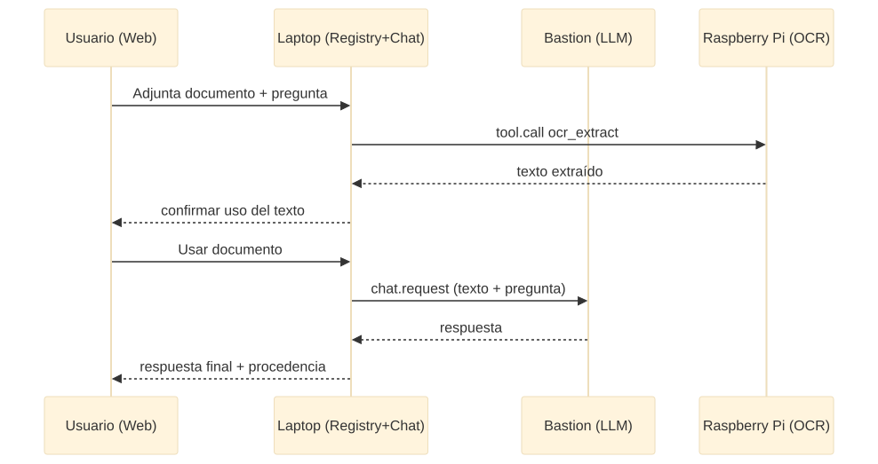

<!--
Charla: Red soberana de IA con hardware reutilizado.
Demo en vivo: 3 equipos reales (laptop + mini-PC + Raspberry Pi 4B)
corriendo el protocolo FHS (Federation of Sovereign Hosts).
-->

<!-- _class: bg-dark -->

# Reutiliza tus equipos viejos

## para una red soberana e IA

Raúl Eduardo González Argote

<!-- notes:
Gancho de apertura: todos tenemos un cajón con una laptop vieja, un mini-PC
que ya no usamos, una Raspberry Pi de un proyecto que quedó a medias.
Hoy vamos a convertir eso en infraestructura de IA real — no un juguete,
una red que de verdad razona y ejecuta herramientas, sin depender de
ningún proveedor externo.
-->

---

<!-- _class: question -->

🤔 ¿Cuántas computadoras "viejas" tienes guardadas ahora mismo?

<!-- notes:
Pedir que levanten la mano. Casi todos tienen algo: una laptop de hace
6-8 años, un mini-PC, una Raspberry Pi de un curso o hackathon.
Esa "basura" tiene más cómputo del que necesitamos para esta demo.
-->

---

<!-- _class: question -->

🤔 ¿Toda la IA tiene que vivir en la nube de alguien más?

<!-- notes:
Esta es la pregunta central de la charla.
Chat GPT, Claude, Gemini: excelentes, pero centralizados.
¿Qué pasa si tu comunidad, tu escuela, tu colectivo quiere IA útil
sin mandar sus datos a un tercero, sin pagar suscripción, sin depender
de que ese servicio siga existiendo mañana?
-->

---

## El modelo de nube tradicional

<div class="card">



</div>

Todos tus datos y tu cómputo dependen de **un solo proveedor**.

<!-- notes:
Así funciona ChatGPT, Claude, Gemini y la mayoría de asistentes hoy.
Excelentes herramientas — pero centralizadas: un solo dueño decide
disponibilidad, precio y qué pasa con tus datos.
-->

---

## La alternativa: red soberana federada

<div class="card">



</div>

Cada nodo — tuyo, de un vecino, de tu comunidad — aporta una capacidad
distinta. **Nadie es dueño de toda la red.**

<!-- notes:
Este es el cambio de modelo mental de la charla: no reemplazar a un
proveedor por otro, sino no depender de ningún proveedor único.
-->

---

## El objetivo

Que **cualquier comunidad** — un equipo de trabajo, una escuela, un
colectivo — pueda armar su propia red de IA:

- Con el **hardware que ya tiene**, no con presupuesto nuevo.
- **Sin ceder control** de sus datos a un tercero.
- Donde cualquiera puede **sumar un nodo** sin pedir permiso a un
  operador central.
- Donde la **privacidad es parte del protocolo**, no un aviso legal.

<!-- notes:
No es "otro chatbot". Es un protocolo de federación: un catálogo común
donde las máquinas se anuncian, se descubren y se usan entre sí.
-->

---

<!-- _class: bg-dark -->

# FHS

## Federation of Sovereign Hosts

Federación de Nodos Soberanos

<!-- notes:
FHS es el protocolo que hace posible esta red. JSON sobre WebSocket —
no depende de TypeScript ni de ningún lenguaje en particular.
-->

---

## Las reglas del protocolo (resumen)

1. **Identidad verificable** — todo nodo tiene un id único.
2. **Servicios declarados** — un nodo dice qué ofrece, nadie escanea puertos.
3. **Capacidades, no implementaciones** — se pide `document.ocr`, no "¿tienes Tesseract?".
4. **Transparencia obligatoria** — toda respuesta dice qué modelo razonó y qué datos viajaron.
5. **Registry observable, no controlador** — solo sabe quién existe, no ejecuta nada ni ve datos.

<!-- notes:
Hay 10 reglas en total documentadas en el repo. Estas 5 son las que
más le importan a la audiencia para entender el resto de la charla.
-->

---

## Hoy: 3 equipos, 3 roles, una sola red



<!-- notes:
Esta es la demo de hoy, en vivo, con hardware real:
- Una laptop vieja: Registry + chat web.
- Un mini-PC (bastion): corre el modelo de lenguaje local (llama.cpp).
- Una Raspberry Pi 4B: hace OCR (extracción de texto de documentos).
Cada uno en su propia red, cada uno aportando una capacidad distinta.
-->

---

## Cómo se registra un nodo

- El nodo se conecta al Registry: `hello` → `register` → `heartbeat` cada 10s.
- Si deja de responder 30s, se marca como perdido — **automáticamente**.
- El Registry nunca inicia la conexión — el nodo siempre llega primero.

```
Provider → Registry: hello { providerId }
Registry → Provider: welcome { leaseSeconds: 30 }
Provider → Registry: register { manifest }
Registry → Provider: registered { acceptedServices }
```

<!-- notes:
Esto es lo que permite topologías asimétricas: la Raspberry Pi puede
estar detrás de un NAT distinto, en otra subred — mientras pueda iniciar
la conexión hacia el Registry, ya es parte de la red.
-->

---

## Qué pasa cuando adjuntas un documento



<!-- notes:
El usuario adjunta un PDF en el chat. El texto se extrae en la
Raspberry Pi (OCR), el usuario confirma que quiere usarlo, y la
pregunta + el texto extraído viajan al modelo que corre en el mini-PC.
Cada paso queda registrado: qué nodo hizo qué.
-->

---

<!-- _class: bg-dark -->

# Demo en vivo

## Laptop + mini-PC (LLM) + Raspberry Pi 4B (OCR)

<!-- notes:
Aquí cambiar a la demo real:
1. Mostrar `just poc-status` en las 3 máquinas — qué está corriendo de verdad.
2. Abrir el chat web.
3. Mandar un mensaje simple — mostrar que responde el modelo del mini-PC.
4. Adjuntar un PDF — mostrar la extracción real desde la Raspberry Pi.
5. Confirmar "usar documento" — mostrar la respuesta final con procedencia.
-->

---

## Privacidad: parte del protocolo, no un aviso legal

| Concepto | Qué controla |
|---|---|
| `scope` | Quién puede resolver tu petición: `local`, `network`, `community`, `external` |
| `retention` | Qué hace cada nodo con tus datos: `none`, `session`, ... |
| `provenance` | Qué modelo razonó, qué herramienta se usó, a dónde viajaron tus datos |

Cada respuesta trae su propia auditoría — **sin excepción**.

<!-- notes:
No es "confía en nosotros". El scope es un techo duro sobre qué
proveedores pueden ver tu petición. El provenance viaja en cada
respuesta del chat, siempre.
-->

---

## Súmate: sé un nodo de la red

Cualquier computadora puede aportar una capacidad:

- **LLM provider**: envuelve un modelo local (llama.cpp, Ollama, vLLM) y lo expone por WebSocket.
- **Tool provider**: OCR, búsqueda, un servicio interno — cualquier capacidad reutilizable.
- El Registry **no necesita cambios de código** para reconocer tu nodo — solo que cumpla el contrato.

`github.com/rafex/galaxIA` — documentación completa, guía de integración, decisiones de diseño.

<!-- notes:
Insistir: no hace falta escribir TypeScript. FHS es JSON sobre
WebSocket — cualquier lenguaje que hable eso puede sumarse.
-->

---

## Qué sigue

- SDKs de referencia en **Python, Rust y Java** — hoy solo hay TypeScript.
- **Identidad criptográfica real** (Ed25519) en vez del DID simplificado actual.
- **Descubrimiento descentralizado** — reemplazar el Registry central por mDNS/DHT.
- Un **modelo de confianza comunitaria**: reputación, vetos, políticas de privacidad más finas.

<!-- notes:
Esto es una PoC, no un producto terminado. Lo interesante es que ya
funciona de punta a punta con hardware real y heterogéneo.
-->

---

<!-- _class: bg-dark -->

# Gracias

## github.com/rafex/galaxIA

Raúl Eduardo González Argote
rafex@rafex.dev

<!-- notes:
Cierre: invitar a clonar el repo, probar el chat, y — sobre todo —
a sumar su propia computadora vieja como un nodo más de la red.
-->
