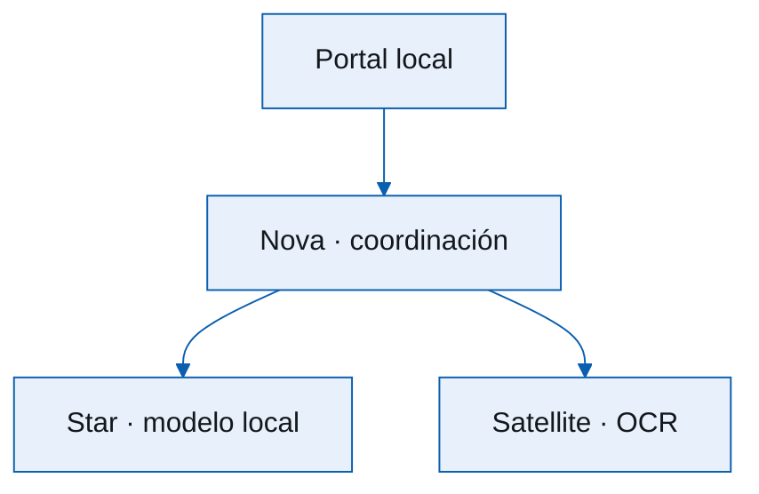

# Red soberana e IA local

Reutilizando equipos antiguos con software libre

<small>Spike Slidev · compatible con el repositorio Marp actual</small>

<!--
  Nota del presentador: este piloto conserva el tema narrativo de la charla
  actual, pero prueba una portada CSS y assets compartidos sin tocar el deck
  Marp original.
-->

---
layout: two-cols
---

# Arquitectura

<v-clicks>

- Nodos locales con hardware reutilizado
- Modelos pequeños cerca de los datos
- Comunicación soberana entre capacidades

</v-clicks>

::right::

<!-- Nota: el layout two-cols y v-clicks son capacidades nativas de Slidev. -->

---

# Un mensaje, varios nodos

La presentación sigue siendo Markdown versionable; Vue, CSS y demos pueden
entrar sólo donde aporten valor.

<!--
  Nota del presentador: este es el umbral de adopción propuesto. Lo nuevo
  puede aprovechar Mermaid, transiciones y componentes, mientras la fuente
  Marp y su release siguen intactas.
-->

