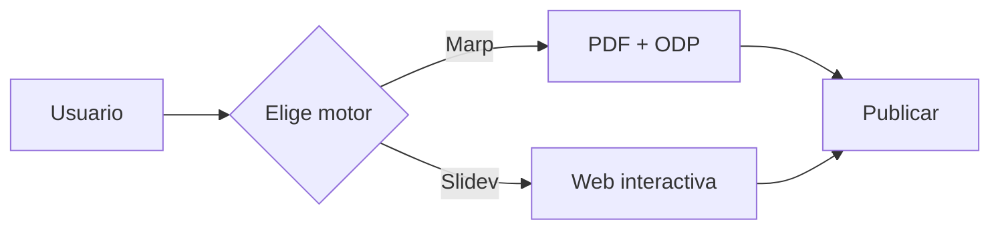

# Slidev en 10 minutos

Una presentación web interactiva con animaciones, código en vivo y presenter mode.

<!--
Notas del presentador (solo visibles con Ctrl+P):
- Bienvenida a todos
- Esta es una demo de Slidev
- Muestra lo que puedes hacer
-->

---

layout: intro
transition: fade

# ¿Qué es Slidev?

Slidev es un framework para crear presentaciones web modernas con:
- Markdown simple
- Componentes Vue interactivos
- Animaciones y transiciones
- Presenter mode con notas
- Exportación a PDF, PPTX, PNG

<!--
Presenter: Explicar brevemente qué diferencia a Slidev de las herramientas tradicionales
-->

---

layout: two-cols
transition: slide-right

# Ventajas

<v-click>
- 📝 Markdown puro
- 🎨 Temas personalizables
- 🎬 Animaciones suaves
- 🖥️ Presenter mode
- 📱 Responsive
</v-click>

::right::

# Casos de uso

<v-click>
- Charlas técnicas
- Demos en vivo
- Tutoriales interactivos
- Conferencias
- Capacitaciones
</v-click>

<!--
Presenter: Pausar aquí si hay preguntas sobre cuándo usar Slidev
-->

---

# Layouts disponibles

Slidev viene con muchos layouts predefinidos:

```javascript
// Algunos ejemplos:
layout: cover        // Portada completa
layout: intro        // Introducción
layout: two-cols     // Dos columnas
layout: image-left   // Contenido + imagen
layout: center       // Centrado
layout: statement    // Cita o frase
```

---

layout: image-left
image: './public/slidev.png'
transition: fade

# Imágenes

Puedes incluir imágenes a los lados o como fondo completo.

Usan el layout `image-left` o `image-right` para posicionarlas automáticamente.

Para fondos completos, usa `` en Markdown.

---

# Código con highlight

Destaca líneas específicas con sintaxis `{líneas}`:

```python {2,4-6}
def fibonacci(n):
    if n <= 1:        # Destacado
        return n
    return (          # Destacado
        fibonacci(n-1) +  # Destacado
        fibonacci(n-2)    # Destacado
    )
```

---

# Evolución de código

Presiona `→` para ver cómo evoluciona el código:

```javascript {all|1|2|3|4|5}
const greet = (name) => {
  console.log(`Hola, ${name}`)
}
greet("Slidev")
// Salida: Hola, Slidev
```

<!--
Presenter: Mostrar paso a paso cómo el código cobra sentido
-->

---

# Animaciones: v-click

Los elementos aparecen con click:

- Primer punto (siempre visible)

<v-click>
- Segundo punto (click 1)
</v-click>

<v-click>
- Tercer punto (click 2)
</v-click>

<v-click>
- Cuarto punto (click 3)
</v-click>

---

# Diagramas Mermaid interactivos



---

layout: statement
transition: bounce

# Las notas del presentador son tu aliado

Presiona `Ctrl+P` durante la presentación para ver notas privadas, timer y navegación.

<!--
Presenter: 
- Este es un buen momento para hacer una pausa
- Pregunta si hay dudas
- Menciona que las notas ayudan a no olvidar puntos importantes
-->

---

# Componentes Vue personalizados

Puedes insertar componentes Vue directamente:

<Counter />

---

layout: two-cols
transition: slide-up

# Ventajas vs Marp

Slidev excels at:

<v-click>
- Presenter mode integrado
- Demos en vivo con Vue
- Animaciones complejas
- Componentes interactivos
- Exportación HTML
</v-click>

::right::

# Ventajas vs Herramientas web

<v-click>
- Markdown puro (sin UI)
- Rapid development
- Built-in export
- Responsive design
- Open source
</v-click>

---

# Exportación

Genera presentaciones en múltiples formatos:

```bash
# PDF
slidev export slides.md --format pdf

# PPTX (una imagen por slide)
slidev export slides.md --format pptx

# PNG (imágenes por slide)
slidev export slides.md --format png

# HTML estática
slidev build
```

---

layout: center
class: text-center
transition: fade

# ¿Preguntas?

Accede a [sli.dev](https://sli.dev) para más documentación

---

# Recursos

- 📖 [Documentación oficial](https://sli.dev)
- 🎨 [Temas y componentes](https://sli.dev/themes/gallery.html)
- 💬 [Comunidad Discord](https://discord.gg/slidev)
- 📝 [Guía local](../../docs/03-slidev.md)

---

layout: cover
transition: slide-left

# ¡Gracias!

Crea tu primera presentación Slidev ahora mismo.

```bash
./scripts/new-presentacion.sh --engine slidev
just slidev-dev presentaciones/mi-presentacion/slidev/slides.md
```

<!--
Presenter: 
- Agradecer a la audiencia
- Proporcionar formas de contacto
- Ofrecer ayuda para que creen sus propias presentaciones
-->
