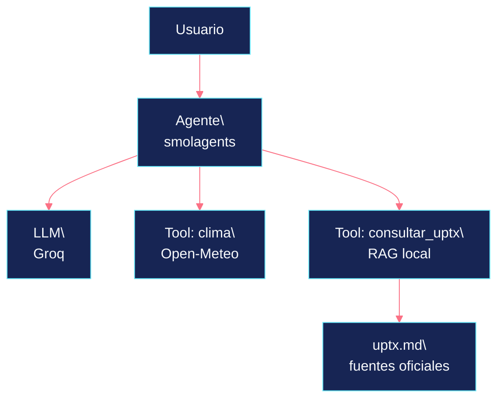

# Construye tu Agente IA

## en 120 minutos


<p class="cover-subtitle">Python · OpenCode · Groq · Tools · RAG</p>

<div class="cover-meta">Taller práctico de construcción con IA</div>

<!--
Notas del presentador: abrir con el resultado. La promesa es concreta: al terminar, cada persona tendrá un agente funcional que puede consultar una API y su propia base de conocimiento.
-->

---
class: statement-slide
---

# Resultado del taller

<div class="statement-lead">Cada participante termina con un agente que decide cuándo consultar una herramienta.</div>

<div class="statement-list">
  <span>Python ejecutable</span>
  <span>Groq configurado</span>
  <span>Clima real</span>
  <span>Conocimiento UPTx</span>
</div>

<!--
Notas del presentador: presentar el entregable antes de explicar la teoría. El ejercicio funciona desde la terminal con una sola API key de Groq.
-->

---
class: statement-slide
---

# En dos horas, una aplicación deja de limitarse a contestar

<div class="statement-lead">El agente aprende a elegir una herramienta cuando necesita información externa.</div>

<div class="statement-list">
  <span>LLM</span>
  <span>Agente</span>
  <span>Tools</span>
  <span>RAG</span>
</div>

<!--
Notas del presentador: no empezar con una definición larga. La primera meta es que el grupo entienda qué va a construir y por qué vale la pena.
-->

---
class: question-slide
---

# La pregunta que guía el taller

<blockquote>¿Cómo hacemos que una IA use herramientas y consulte conocimiento propio?</blockquote>

<div class="question-grid">
  <div><strong>LLM</strong><small>Genera una respuesta</small></div>
  <div><strong>Tool</strong><small>Obtiene datos o ejecuta una acción</small></div>
  <div><strong>RAG</strong><small>Recupera fragmentos relevantes</small></div>
</div>

<!--
Notas del presentador: presentar sólo estos cuatro conceptos. El resto aparece cuando el código lo necesita.
-->

---
layout: two-cols
class: architecture-slide
---

# La arquitectura final conecta cinco piezas

<div class="architecture-copy">
  <p>El usuario hace una pregunta. El agente decide si puede responder con el modelo o si necesita consultar una herramienta.</p>
  <p class="muted">Groq es el proveedor validado en el taller. La interfaz compatible con OpenAI deja abierta una migración posterior.</p>
</div>

::right::



<!--
Notas del presentador: señalar que el modelo no recibe mágicamente el reglamento. El agente elige la herramienta y la herramienta consulta la fuente.
-->

---
class: timeline-slide
---

# El recorrido cabe en 120 minutos

<div class="timeline">
  <div class="time-block"><b>00:00</b><span>Mapa del agente</span><small>Arquitectura y objetivo</small></div>
  <div class="time-block"><b>00:08</b><span>Acceso</span><small>Groq API key</small></div>
  <div class="time-block"><b>00:23</b><span>Proyecto</span><small>Python con OpenCode</small></div>
  <div class="time-block"><b>00:35</b><span>Primer LLM</span><small>Proveedor intercambiable</small></div>
  <div class="time-block"><b>00:50</b><span>Agente</span><small>smolagents en acción</small></div>
  <div class="time-block"><b>01:05</b><span>Tool externa</span><small>Clima vía API</small></div>
  <div class="time-block"><b>01:20</b><span>RAG</span><small>UPTx en Markdown</small></div>
  <div class="time-block"><b>01:50</b><span>Prueba y cierre</span><small>Preguntas reales</small></div>
</div>

<p class="timeline-note">Los últimos 10 minutos absorben problemas de Wi-Fi, login, dependencias o API keys.</p>

<!--
Notas del presentador: el cronograma tiene un colchón explícito. No intentar cubrir memoria, MCP, multiagentes o una interfaz web en esta sesión.
-->

---
class: keys-slide
---

# Los secretos viven fuera del código

<div class="two-up">
  <div>
    <h3>Acceso</h3>
    <pre><code>export GROQ_API_KEY="..."
export OPENROUTER_API_KEY="..."</code></pre>
    <p>La llave identifica al proveedor. El modelo se elige después.</p>
  </div>
  <div class="warning-panel">
    <div class="key-equation">API Key <span>≠</span> modelo</div>
    <p>La clave nunca entra al repositorio, al historial de Git ni a un archivo compartido.</p>
    <code>api_key = "gsk_..."</code>
    <small>Ese patrón queda fuera del taller.</small>
  </div>
</div>

<!--
Notas del presentador: dedicar tiempo real a que cada participante cree y pruebe sus variables de entorno.
-->

---
layout: two-cols
class: code-slide
---

# OpenCode acelera la primera estructura

<div class="architecture-copy">
  <p>La IA ayuda a levantar el esqueleto. La persona decide qué entra, qué se prueba y qué se entiende.</p>
  <p class="quote-inline">Usamos IA para acelerar la programación, no para dejar de programar.</p>
</div>

::right::

```text
agente-uptx/
├── main.py
├── model.py
├── tools.py
├── retriever.py
├── knowledge/uptx.md
├── tests/
├── pyproject.toml
├── .env.example
└── .gitignore
```

```text
Crea un proyecto Python mínimo
para un agente con smolagents.

Separa el modelo, las tools y los
secretos. Incluye pyproject.toml
y .gitignore. No agregues un
framework web.
```

<!--
Notas del presentador: mostrar el prompt como un punto de partida y revisar con el grupo el resultado generado.
-->

---
class: provider-slide
---

# El proveedor cambia sin romper la aplicación

<div class="provider-flow">
  <div class="provider-app"><b>Nuestra aplicación</b><small>Python + interfaz compatible</small></div>
  <div class="provider-line"></div>
  <div class="provider-choice"><b>Groq</b><small>respuesta rápida</small></div>
  <div class="provider-choice"><b>OpenAI-compatible</b><small>migración opcional</small></div>
</div>

<div class="code-compare">
  <pre><code>cliente = OpenAI(
  api_key=GROQ_API_KEY,
  base_url=GROQ_BASE_URL,
)</code></pre>
  <pre><code>cliente = OpenAI(
  api_key=OPENROUTER_API_KEY,
  base_url=OPENROUTER_BASE_URL,
)</code></pre>
</div>

<p class="muted center">Primero comprobamos una llamada al LLM. Después le damos capacidad de decisión.</p>

<!--
Notas del presentador: no convertir esta parte en una comparación de modelos. El aprendizaje es que la aplicación desacopla proveedor y modelo.
-->

---
class: loop-slide
---

# Un agente decide cuándo necesita una herramienta

<div class="loop-compare">
  <div class="loop-card">
    <small>Antes</small>
    <strong>Pregunta</strong>
    <span>↓</span>
    <strong>LLM</strong>
    <span>↓</span>
    <strong>Respuesta</strong>
  </div>
  <div class="loop-card loop-card-active">
    <small>Después</small>
    <strong>Pregunta</strong>
    <span>↓</span>
    <strong>Agente</strong>
    <em>¿necesito datos externos?</em>
    <span>↓</span>
    <strong>Acción y resultado</strong>
    <span>↓</span>
    <strong>Respuesta</strong>
  </div>
</div>

<p class="center callout">El ciclo es pequeño. La decisión es lo importante.</p>

<!--
Notas del presentador: aquí se introduce smolagents con el mínimo de teoría. El agente recibe un modelo y una lista de tools.
-->

---
layout: two-cols
class: tool-slide
---

# Una función Python puede convertirse en una herramienta útil

<div class="architecture-copy">
  <p>Open-Meteo sirve para demostrar una integración real sin desviar la sesión hacia la autenticación de otra plataforma.</p>
  <p>El agente recibe el nombre de la función, su descripción, sus argumentos y su retorno.</p>
</div>

::right::

```python
@tool
def obtener_clima(
    latitude: float,
    longitude: float,
) -> str:
    """Obtiene las condiciones
    meteorológicas actuales."""
    response = requests.get(
        "https://api.open-meteo.com/v1/forecast",
        params={
            "latitude": latitude,
            "longitude": longitude,
            "current": "temperature_2m",
        },
    )
    return response.text
```

<p class="code-caption">Una API + una función Python = una Tool</p>

<!--
Notas del presentador: probar una pregunta concreta, como la temperatura cerca de la UPTx. El objetivo es observar la llamada, no enseñar meteorología.
-->

---
class: rag-slide
---

# El reglamento se convierte en conocimiento consultable

<div class="rag-pipeline">
  <div><b>Reglamento.pdf</b><small>fuente institucional</small></div>
  <span>↓</span>
  <div><b>Texto</b><small>extracción y limpieza</small></div>
  <span>↓</span>
  <div><b>Chunks</b><small>fragmentos recuperables</small></div>
  <span>↓</span>
  <div><b>Tokens</b><small>términos comparables</small></div>
  <span>↓</span>
  <div class="rag-final"><b>Retriever local</b><small>coincidencias relevantes</small></div>
</div>

<div class="rag-note">El taller usa un Markdown versionado y una búsqueda local para funcionar sin otra API key ni un servicio externo.</div>

<!--
Notas del presentador: explicar que la recuperación sigue siendo RAG aunque el índice sea ligero. El objetivo es que cada participante pueda leer y modificar la base.
-->

---
layout: two-cols
class: rag-tool-slide
---

# La recuperación gana sentido cuando el agente la elige

<div class="architecture-copy">
  <p>La base de conocimiento entra al agente como una segunda Tool.</p>
  <p class="quote-inline">El RAG deja de ser una demo aislada y pasa a formar parte del ciclo de decisión.</p>
  <div class="mini-flow">pregunta → agente → consultar_uptx() → fragmentos relevantes</div>
</div>

::right::

```python
@tool
def consultar_uptx(
    pregunta: str,
) -> str:
    """Consulta el conocimiento institucional de la UPTx."""
    return retriever.search(pregunta)
```

```python
tools = [
    obtener_clima,
    consultar_uptx,
]
```

<!--
Notas del presentador: remarcar que el agente no memoriza el reglamento. Recupera contexto cuando la pregunta lo requiere.
-->

---
class: test-slide
---

# Cuatro preguntas prueban si el agente aprendió a consultar

<div class="test-list">
  <div><b>01</b><span>¿Qué es una evaluación de recuperación?</span><small>Pregunta general</small></div>
  <div><b>02</b><span>Según el reglamento, ¿cuántas horas de servicio social debo realizar?</span><small>Resultado esperado: 480 horas</small></div>
  <div><b>03</b><span>¿Puedo estar inscrito en dos programas académicos?</span><small>El artículo 10 responde que no</small></div>
  <div><b>04</b><span>¿Cuánto tiempo tengo para pedir una revisión de examen?</span><small>El artículo 30 contempla tres días</small></div>
</div>

<p class="muted">Las pruebas deben mostrar cuándo el agente responde y cuándo recupera información del documento.</p>

<!--
Notas del presentador: usar las preguntas como pruebas observables. No prometer que el documento sustituye la confirmación de la normatividad vigente.
-->

---
class: scope-slide
---

# Dos horas alcanzan si el alcance se mantiene enfocado

<div class="scope-columns">
  <div>
    <small>Construimos</small>
    <ul>
      <li>Un agente funcional en Python</li>
      <li>Groq como proveedor validado</li>
      <li>Una Tool conectada a Internet</li>
      <li>Una Tool conectada a Markdown local</li>
    </ul>
  </div>
  <div>
    <small>Reservamos para otra sesión</small>
    <ul>
      <li>Memoria persistente</li>
      <li>MCP y multiagentes</li>
      <li>Interfaz web</li>
      <li>Vector store desde cero</li>
    </ul>
  </div>
</div>

<!--
Notas del presentador: el recorte protege la experiencia de live coding. La sesión debe terminar con un agente funcionando, no con una lista de temas pendientes.
-->

---
class: final-architecture-slide
---

# El entregable final es un agente que puede explicar sus decisiones

<div class="final-stack">
  <div class="stack-item"><b>Usuario</b><small>pregunta real</small></div>
  <span>↓</span>
  <div class="stack-item highlight"><b>Agente</b><small>elige si necesita una Tool</small></div>
  <span>↓</span>
  <div class="stack-row">
    <div class="stack-item"><b>LLM</b><small>Groq</small></div>
    <div class="stack-item"><b>Tool</b><small>Open-Meteo</small></div>
    <div class="stack-item"><b>Tool</b><small>RAG local UPTx</small></div>
  </div>
</div>

<p class="final-message">LLM → Agente → Tools → APIs → RAG → conocimiento propio</p>

<!--
Notas del presentador: cerrar conectando el resultado con la promesa de portada. Cada participante se lleva un agente pequeño, explicable y ampliable.
-->

---
class: closing-slide
---

# Un agente útil empieza con una pregunta real


<p class="cover-subtitle">Y con una herramienta que puedas explicar.</p>

<div class="cover-meta">Construye tu Agente IA en 120 minutos</div>

<!--
Notas del presentador: abrir espacio para preguntas y recuperar el objetivo de cada persona. Proponer que el siguiente documento sea propio, siempre que pueda probarse con preguntas concretas.
-->

---
class: contact-slide
---

# Contacto

> Raúl Eduardo González Argote

- 🔗 [**LinkedIn**](https://www.linkedin.com/in/soft-architect-raul-gonzalez)
- ✉️ [**rafex@rafex.dev**](mailto:rafex@rafex.dev)
- 💻 [**github.com/rafex**](https://github.com/rafex)
- 📝 [**theworldofrafex.blog**](https://theworldofrafex.blog/)

<!--
Notas del presentador: dejar visibles los enlaces y recordar que el ejercicio puede ampliarse con nuevas tools y documentos.
-->
